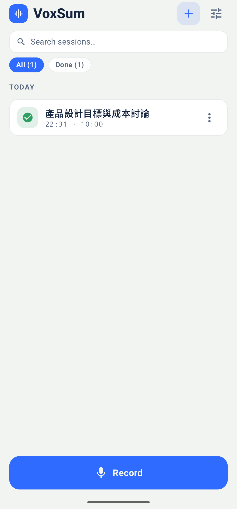

<p align="center">
  
</p>

<h1 align="center">VoxSum for Android</h1>

<p align="center">
  <b>Turn any audio into a clean, speaker-labelled transcript and a short summary —<br>entirely on your phone, fully offline.</b>
</p>

<p align="center">
  <a href="https://github.com/vieenrose/VoxSumDroid/releases/latest"></a>
  
  
  
</p>

<p align="center"><a href="README.zh-TW.md">繁體中文說明 →</a></p>

---

Record a meeting, open a voice memo, drop in a podcast or a YouTube link — VoxSum writes out **who said
what**, then gives you a **concise summary** in the language you choose. Everything happens **on the
device**: no account, no cloud, no subscription, and nothing ever leaves your phone.

VoxSum is a **recording studio**: the home screen is your **session list**, every recording is
**auto-saved the moment you stop** (a crash or a stray tap can never lose one), and **recording never
waits for processing** — capture talks back-to-back all day, then let the app transcribe and summarize
them one by one while you watch each session's live status.

> New here? The **[5-minute Quick Start →](docs/QUICKSTART.md)** walks through every feature.

<p align="center"></p>
<p align="center"><i>Open a finished session: the summary, the speaker-tagged transcript, and tap-to-play with the current line highlighted.</i></p>

## Why VoxSum

- 🛡️ **Private by design** — your audio never leaves the phone, so confidential recordings can't leak to a cloud.
- ✈️ **Works offline** — once set up, no network is needed: on a plane, a train, or off the grid.
- 💰 **No subscription** — own it outright. No metered minutes, no monthly fee.

## Screenshots

<p align="center">
  
  
  
  
</p>
<p align="center"><i>The studio home (session list with live statuses) · live transcript with speakers · summary · summary-language picker</i></p>

## What you can do

**🎛️ Work like a studio**
- **The home screen is your session list** — every recording, with its live status: *Not processed · Queued · Processing (with phase and %) · Done*.
- **Record talks back-to-back** — a full-screen recording booth with a big timer, mic level bars, and two giant buttons: **⏭ Next talk** ends one session and instantly starts the next (its processing is deferred); **⏹ Stop & save** saves and processes in the background while you're free to record again.
- **Never lose a recording** — audio is saved to the library the moment the mic stops, even on a crash or an accidental stop; finished sessions embed their transcript + summary into a self-contained `.m4a` automatically.
- **Process on your schedule** — *Process pending (n)* transcribes, diarizes, summarizes and titles every saved recording in the background. Batches are processed **efficiently**: everything is transcribed first, then the summarizer loads **once** for the whole batch — and the queue survives app kills, resuming without redoing any finished work.
- **Manage your files** — tap or long-press any session: *Process now · Rename · Share audio · Delete* — plus *Remove from queue* on a queued session and *Stop processing* on the one being processed. Name a session while recording — your name always outranks the AI-generated title.

**🎙️ Bring in audio from anywhere**
- **A file** on your device — most common audio and video formats work.
- **Share from another app** — send a voice note or an audio/video file straight to VoxSum (from LINE, a recorder, your browser…) and it starts transcribing.
- **Record live** — watch the transcript appear sentence by sentence as you speak (a collapsible strip in the recording booth), with **mic level bars** so you know it hears you.
- **A podcast** — search, pick an episode, and transcribe it.
- **A YouTube link** — paste a URL, or search by keyword.
- **Reopen a saved session** — tap any *Done* session in the list and pick up exactly where you left off.

**📝 Read and understand**
- **Live transcript** — lines show up as soon as you speak; you can start reading (and playing) before it finishes.
- **Who spoke when, live** — speakers are identified *while* the words are transcribed, in the same pass: each line is tagged and colour-coded by speaker as you record, with an automatic speaker count (up to 8 speakers). Benchmarked on the AMI and AISHELL-4 meeting corpora at **95.4% / 92.3%** time-weighted attribution while labelling **99%** of the speech ([details](tools/nemo-eval/README.md)). VoxSum can even **guess speakers' real names** from what they say.
- **A summary in your language, your way** — a short title and a **concise** summary (a handful of points, never a wall of text) as **bullets, an executive brief, or a narrative**. It is written in the recording's language; Chinese can be shown in **繁體中文** or **简体中文** (defaulting from your phone's region).
- **Action items & decisions** — pull a draft checklist of who-does-what and the key decisions out of a meeting, ready to edit.
- **Search the transcript** — find any word in a long recording; matches highlight and you can step through them.
- **A built-in player, in sync** — docked at the bottom like a music app: tap any line to jump there, and the current line highlights as it plays.
- **Easy on the eyes** — **Light**, **Dark**, or a flat high-contrast **E-ink** theme built for e-paper readers (Boox and the like). **Auto** — the default — follows your system's light/dark setting. Switch any time in **Settings → Appearance**.

**✏️ Make it yours**
- **Edit anything** — fix a word, rename a speaker, tweak the title or summary, right in place.
- **Fix the speakers** — move a misattributed line to the right person, or merge two speakers into one.
- **Copy** the whole summary with one tap.
- **Export the words** — one **Export & share…** sheet, grouped by what you get: the **VoxSum session** (`.m4a`), a **document** (**PDF**, **Markdown**, plain text) carrying the title, summary, action items and the timestamped transcript, or **subtitles** (`.srt`/`.vtt`/`.lrc`) with speaker labels. Everything can be **saved or shared**, and the transcript copies to the clipboard in one tap.
- **Re-run** the transcription, the summary, **just the speaker detection** (*Re-detect speakers*), or the speaker-name detection whenever you like — and VoxSum keeps everything consistent: change the summary language or style (or edit the transcript) and it offers a one-tap **re-summarize**, which also refreshes the title (unless you wrote your own). Switching just between **繁體中文 ↔ 简体中文** converts the title, summary, and transcript **instantly**, no re-run needed.
- **Save or share as one file** — the whole session (audio + transcript + summary + speakers + a cover) packs into a single **`.m4a`**. It **plays in any music app** — showing the title, cover, summary, and the **time-synced transcript** as [scrolling lyrics](#synced-lyrics-in-android-music-players) — and **reopens in VoxSum** with everything intact. `.m4a` reaches the widest set of players (iPhones, cars, every app); older `.ogg` sessions still open too.

## Languages

- **Transcription** handles English, Chinese, and speech that mixes the two.
- **Summaries** are written in the recording's language, in Traditional or Simplified Chinese script for Chinese.
- **The app itself** is available in **English and 繁體中文**.

## Install

The small AI models are **not** bundled — they download once on first use, then the app runs fully
offline. Two ways to install:

**Via F-Droid (recommended — automatic updates).** In your F-Droid client, add this repository
(**Settings → Repositories → ➕**), then install VoxSum from it:

```
https://vieenrose.github.io/VoxSumDroid/repo?fingerprint=c9fe46eb7d87d4fa4e2340a73f78a602eafbab655cbe7c7cb4ead5ab7a00b088
```

 &nbsp; *(or scan to add the repo)*

It's a self-hosted repository (not the official f-droid.org store), so adding it is a one-time step —
after that, updates arrive automatically.

**Sideload the APK.** Download the latest signed APK from the
[**Releases page**](https://github.com/vieenrose/VoxSumDroid/releases/latest) and open it to install
(Android may ask for permission to install from your browser or file manager).

## Good to know

- **First run downloads models.** The first time you use a feature, VoxSum fetches the model it needs
  from **Hugging Face**, verifies its integrity, and caches it. After that you
  can go fully offline. Downloads **resume where they left off** on flaky Wi-Fi, and a corrupt file is
  cleaned up automatically with a one-tap **Retry**.
- **Quiet audio just works.** Far-field or low-volume recordings get an automatic, clip-safe volume
  boost — for transcription, speaker detection, and playback alike.
- **While a transcription is running,** exports and settings are briefly locked so the session can't be
  saved half-finished — they unlock the moment it completes.
- **The only thing it ever sends** is an optional, once-a-day check to GitHub for a new version — no
  tracking, and skipped when you're offline. (F-Droid users get updates through their client instead.)
- **Runs on Android 8.0+.** A recent phone with a few GB of free storage is comfortable. The
  first transcription downloads the speech engine's two models (~275 MB); the first summary
  downloads the summarizer's two (~880 MiB). They never run at the same time: the speech models
  are released before the summarizer loads, and a full transcribe + summarize pass peaks around
  2 GB of memory on a mid-range phone.

## Project status

**Speech engine: one streaming pass (from the next release).** Transcription and speaker
identification now run together, live: [nemo-x-asr-diarizer](https://github.com/vieenrose/nemo-x-asr-diarizer.cpp)
pairs the X-ASR transcriber with NVIDIA's Nemotron-3 diarizer on one audio timeline, so speakers
are tagged while you record instead of in a separate pass after the recording ends. It replaces
the previous pipeline (voice-activity detection + X-ASR, then a separate speaker-clustering pass),
and every setting that only applied to it is gone.

- **Verified:** on 22 ten-minute AMI and AISHELL-4 meetings, speaker attribution is unchanged
  (95.4% / 92.3%, was 95.6% / 92.1%) while 99% of the speech now gets a speaker, up from 81–89%,
  and the diarization error rate drops from 22% to 17% (AMI) and 12% (AISHELL-4).
  [Full results](tools/nemo-eval/README.md).
- **Not yet verified:** speed and memory on a phone. The numbers above come from a desktop run of
  the same engine code. On meetings it can also split off a small extra speaker; *Merge speaker into…*
  fixes that in one tap.

**Summarizer.** As of v0.42.0 VoxSum summarizes with an *agentic* pipeline
rather than a single prompt. The transcript streams past the model in ~2000-token chunks, and the
model edits **one evolving set of notes** through typed operations (add a bullet, revise a bullet,
delete one) instead of writing independent per-chunk digests that are merged at the end. The
practical difference: when a meeting reverses itself — a plan rejected at 12:00 and approved at
48:00 — the notes now *update* the earlier bullet instead of listing both.

Two models work together on-device, both Apache-2.0:

| model | role | size |
|---|---|---|
| MiniCPM5-1B-CURSOR | proposes the note edits | ~656 MiB |
| Granite-4.0-350m-verifier | checks every proposed decision/action against the transcript before it is accepted | ~226 MiB |

Everything the model proposes passes through deterministic checks written in Kotlin: timestamps
must point at a line the model actually saw, a bullet contradicting a later one is dropped,
duplicates are rejected, and section limits are applied by spreading across the meeting rather
than truncating it. The model never writes the notes file directly — the app renders it.

**What is verified.** Op-format correctness (zero malformed operations across English, Chinese and
a 62-minute real meeting, on x86 and on-device), timestamps always resolving to real transcript
lines, and the full pipeline running on a mid-range phone (Dimensity 900) inside ~2 GB peak memory.

**What is not, and you should know it.** Summary *coverage* is unmeasured: on real meetings the
model tends to write few notes, and may miss action items that were clearly stated. We also cannot
yet publish a trustworthy faithfulness figure — our own inversion detector ships in this release,
but the meetings we have are not a fair test set (they overlap the model's training data). Treat
the summary as a helpful first pass, not a record: the app says as much next to every summary, and
every bullet carries a timestamp so you can check it against the transcript in one tap.

## Synced lyrics in Android music players

An exported `.m4a` stores the title, cover, **summary** (in the *comment* tag) and the
**time-synced transcript** (in the *lyrics* tag, as LRC `[mm:ss.xx]` lines). Android players that parse
**synced lyrics** scroll the transcript **in real time** as it plays — read straight from the file,
**no sidecar and no permission**. (Players without sync support just show the text, with the `[mm:ss]`
timestamps visible.)

| App | Open the lyrics here | Real-time sync |
|---|---|---|
| **Retro Music** *(free)* | now-playing lyrics (歌詞) | ✅ |
| **Gramophone** *(free)* | the Lyrics view | ✅ |
| **Musicolet** *(free)* | tap the album cover → lyrics | ✅ |

<p align="center">

&nbsp;
&nbsp;
</p>

*Synced transcript scrolling on a Pixel — **Retro Music**, **Gramophone**, and **Musicolet** (the current line highlights as the audio plays).*

> **Notes.** All three verified on a Pixel — the current line highlights as it plays. The **summary**
> also lives in the standard **comment** tag (song info). A standalone **`.lrc` sidecar** export
> (**Export & share… → Subtitles → LRC**) is also available for players that prefer one.

## For developers

VoxSum is an on-device port of [VoxSum Studio](https://huggingface.co/spaces/Luigi/VoxSum-bak).
Every model runs locally, and everything native is built from source:

- **Speech recognition + speaker diarization, in one streaming pass** —
  [nemo-x-asr-diarizer](https://github.com/vieenrose/nemo-x-asr-diarizer.cpp): X-ASR, a streaming
  Zipformer2 transducer for Chinese + English (via [CrispASR](https://github.com/CrispStrobe/CrispASR)),
  and NVIDIA's streaming Nemotron-3 Diarization (via [audio.cpp](https://github.com/0xShug0/audio.cpp)),
  fused so every word carries the speaker whose turn covers it. Words appear ~0.4 s after they are
  spoken; speaker turns settle ~5 s behind the audio. Two GGUFs, ~275 MB together.
- **Summarization** — [llama.cpp](https://github.com/ggml-org/llama.cpp) over GGUF models
  (see `LlmRegistry.kt`).

All of it runs on ggml. The arm64 build is deliberately pinned to `-march=armv8-a`: Cortex-A73/A72
devices have no dotprod or fp16 arithmetic, and anything above the baseline crashes there.

See [`ARCHITECTURE.md`](ARCHITECTURE.md) for the module map.

### Build from source

Requires Android Studio (Ladybug+), SDK 35, NDK 27.2:

```bash
git clone https://github.com/vieenrose/VoxSumDroid.git
cd VoxSumDroid
git submodule update --init           # NOT --recursive (see .gitmodules / CMakeLists.txt)
./gradlew :app:assembleDebug          # arm64-v8a by default
./gradlew :app:testDebugUnitTest      # JVM unit tests
scripts/test-on-device.sh             # instrumented suite on a connected device
```

`test-on-device.sh` installs under its own application id, so an installed release build — and its
sessions and models — is left untouched. Set `VOXSUM_SEED_MODELS` to a directory laid out like the
app's `files/models` to skip the on-device download.

[`RELEASING.md`](RELEASING.md) covers how tagging `v*` produces a signed release APK via CI, and
[`tools/nemo-eval`](tools/nemo-eval/README.md) the host accuracy run for the speech engine.

## License

[GPL-3.0-or-later](LICENSE). Bundled source dependencies retain their own licenses. Downloaded models
carry theirs: X-ASR (Apache-2.0), Nemotron-3 Diarization (OpenMDW-1.1), and the summarizer models
listed in `LlmRegistry.kt`.
