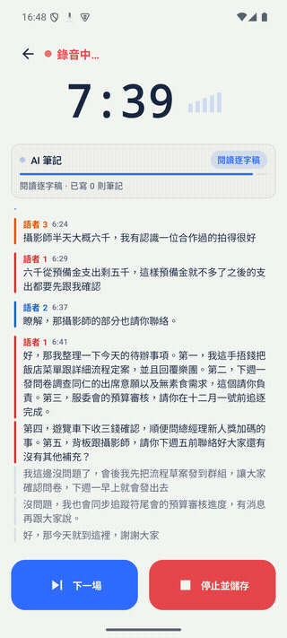
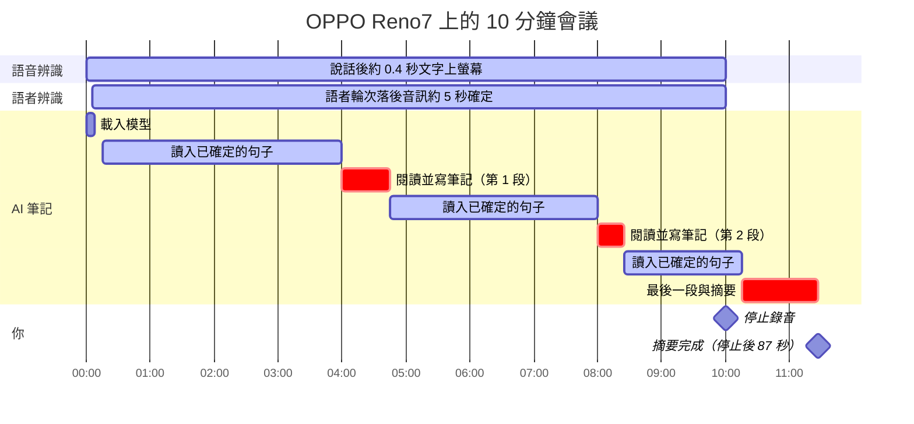

<p align="center">
  
</p>

<h1 align="center">VoxSum for Android</h1>

<p align="center">
  <b>會議錄音 → 標註語者的逐字稿 → 摘要。<br>全程在手機上完成，完全離線。</b>
</p>

<p align="center">
  <a href="https://github.com/vieenrose/VoxSumDroid/releases/latest"></a>
  
  
</p>

<p align="center"></p>

## 特色

- **完全離線、無帳號**：音訊不離開手機，模型只在第一次使用時下載。
- **即時逐字稿與語者**：說話約 0.4 秒後文字上螢幕，同時標註語者（AMI / AISHELL-4 語者歸屬正確率 95.4% / 92.3%）。
- **邊開會邊做筆記**：AI 筆記在錄音中閱讀逐字稿，寫下決議、待辦與數字；停止後約 1.5 分鐘完成摘要。
- **每句都可核對**：摘要與筆記的時間點一下，就從原話開始播放。
- **錄音不會遺失**：停止即存檔，可連續錄多場，稍後再批次處理。
- **可編輯、可匯出**：修正文字與語者；匯出 `.m4a`、PDF、Markdown 或字幕。

## 畫面

| 錄音 | AI 筆記 | 摘要 | 逐字稿 |
|:---:|:---:|:---:|:---:|
|  |  |  |  |

<p align="center"><br><sub>錄音進行中，AI 筆記讀完一段逐字稿後逐字寫下筆記。</sub></p>

示範會議為合成的尾牙籌備會議（三位語者，約 7 分半，[`docs/demo`](docs/demo)），在 8 GB 模擬器上即時錄音拍攝，未經修飾。

## 使用

**錄音**：逐字稿即時出現，語者確定後標上顏色。上方的 AI 筆記卡片顯示它在閱讀逐字稿或正在寫筆記。**下一場**存檔並立即開始下一場；**停止並儲存**直接開啟這場會議，約 1.5 分鐘後摘要完成。

**AI 筆記**：每則筆記標示類型（決議、待辦、提議、未決、數字）與時間；決議、待辦與數字可「核對」，一點就跳到原話。「顯示詳細過程」可看每段的處理情形。

**摘要**：段落式摘要，藍色時間點可直接播放；下方一行是各語者的發言比例。

**逐字稿**：點任一句從該處播放；長按可修改文字或改派語者；點標題可改名。

**匯出與重新處理**（場次右上 **⋮**）：

- **VoxSum 工作階段（.m4a）**：音訊、逐字稿、語者與摘要合為一檔，任何播放器都能播放，也可在 VoxSum 重新開啟。
- **文件**：PDF、Markdown、純文字。**字幕**：SRT、VTT、LRC（含語者）。
- **重新轉錄**（重跑語音辨識與語者分離）或**重新摘要**（保留逐字稿）。

**匯入**：首頁 **＋** 可加入手機上的音訊檔、Podcast、YouTube，或從其他 App 分享音訊過來。

**設定**：外觀（自動、淺色、深色、電子紙）、語言（English、繁體中文、简体中文，介面與產生的文字一起切換）、語者標註延遲、模型管理。

<details>
<summary>更多畫面：匯出、重新處理、設定、匯入</summary>

| 匯出 | 重新處理 | 設定 | 匯入 |
|:---:|:---:|:---:|:---:|
|  |  |  |  |

</details>

## 安裝

從 [**Releases**](https://github.com/vieenrose/VoxSumDroid/releases/latest) 下載 APK。

- Android 8.0 以上，ARMv8.2（dotprod）處理器，約 2019 年後的手機。
- 模型首次使用時下載：語音引擎約 275 MB，摘要模型約 3.35 GB。
- RAM 8 GB 以上：AI 筆記在錄音中同步閱讀；較小的手機在錄音結束後閱讀。
- 唯一的網路連線：下載模型，以及每天檢查一次新版本。

## 已知限制

- 摘要模型以中文會議訓練，英文會議也會寫出中文摘要。
- 約五則筆記中有一則與原話不符（上游量測），請點時間核對。
- 偶爾會多分出發言很少的語者，可用「合併語者」修正。

## 運作方式

- **聽寫**：[nemo-x-asr-diarizer](https://github.com/vieenrose/nemo-x-asr-diarizer.cpp) 是單一串流引擎，在同一條時間軸上完成語音辨識（X-ASR）與語者分離（Nemotron-3）。
- **AI 筆記與摘要**：[Gemma-4-E2B 會議模型](https://huggingface.co/Luigi/gemma-4-E2B-meeting-agent-zh-GGUF) 在 [llama.cpp](https://github.com/ggml-org/llama.cpp) 上執行。

錄音時，語音辨識優先（它落後就會漏音）；AI 筆記在背景把已確定的句子讀進上下文，每累積約 2,000 token（數分鐘的語音）才真正閱讀一次並寫筆記。停止後只剩最後一段要讀，所以摘要很快完成。在 OPPO Reno7（8 GB）上，10 分鐘會議的摘要於停止後 87 秒完成，記憶體峰值 3.0 GB。

<details>
<summary>時間軸：10 分鐘會議中各元件何時工作</summary>



</details>

模組對應見 [`docs/ARCHITECTURE.md`](docs/ARCHITECTURE.md)，準確度評測見 [`tools/nemo-eval`](tools/nemo-eval/README.md)。

## 從原始碼建置

需要 Android Studio、SDK 35、NDK 27.2：

```bash
git clone https://github.com/vieenrose/VoxSumDroid.git && cd VoxSumDroid
git submodule update --init           # 不要加 --recursive
./gradlew :app:assembleDebug          # arm64-v8a；模擬器用 -PvoxsumAbi=x86_64
./gradlew :app:testDebugUnitTest
scripts/test-on-device.sh             # 裝置上的儀器測試（獨立 app ID，不影響正式版）
```

## 授權

應用程式以 [GPL-3.0-or-later](LICENSE) 授權；模型各依其授權：

| 元件 | 授權 |
|---|---|
| X-ASR（語音辨識） | Apache-2.0 |
| [Nemotron-3 Diarization（語者分離）](https://github.com/vieenrose/nemo-x-asr-diarizer.cpp) | OpenMDW-1.1 |
| [Gemma-4-E2B 會議模型（AI 筆記、摘要）](https://github.com/vieenrose/meeting-summarizer) | Apache-2.0 |

示範音訊：合成會議（VibeVoice-1.5B，MIT）。準確度評測：AISHELL-4（CC BY-SA 4.0）、AMI（CC BY 4.0）。
