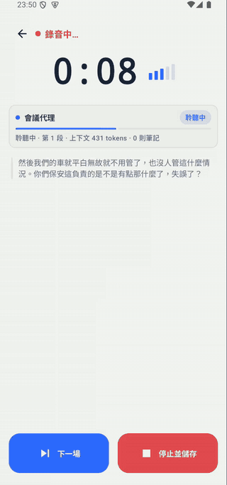
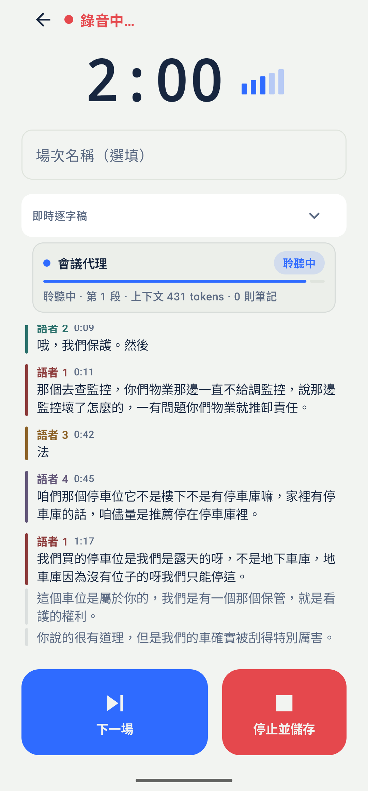
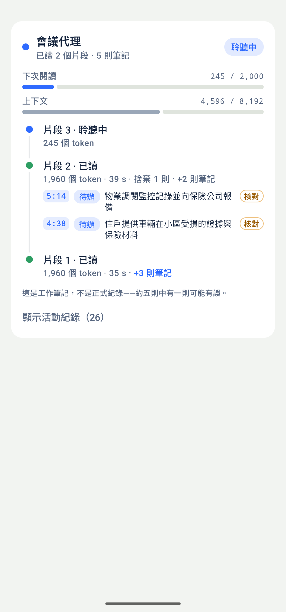
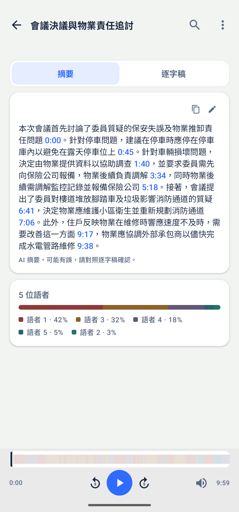
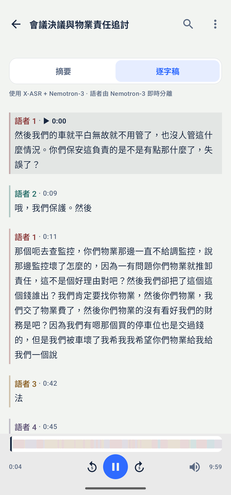
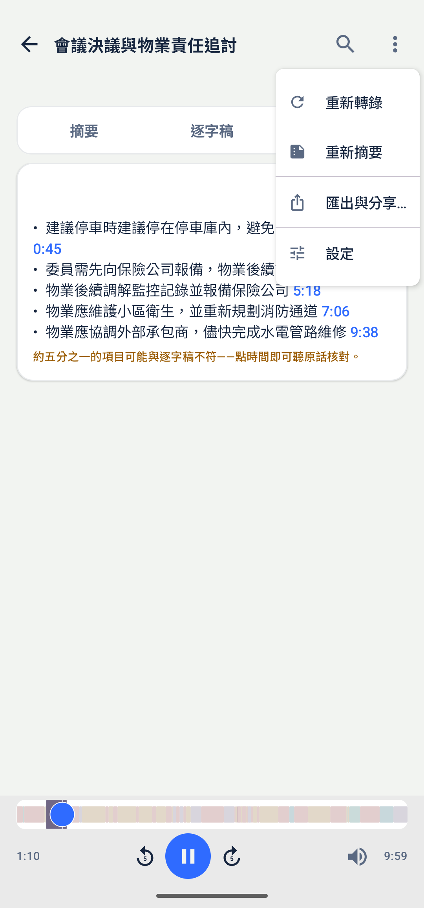
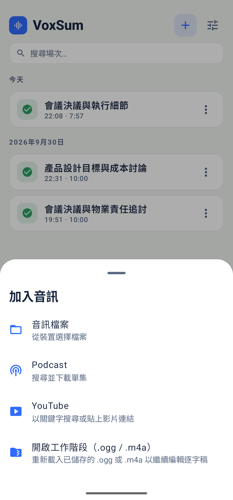
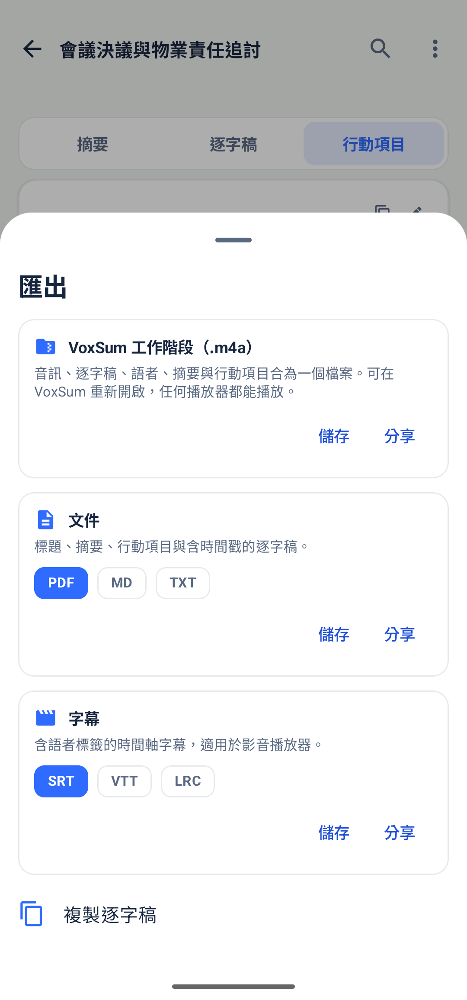
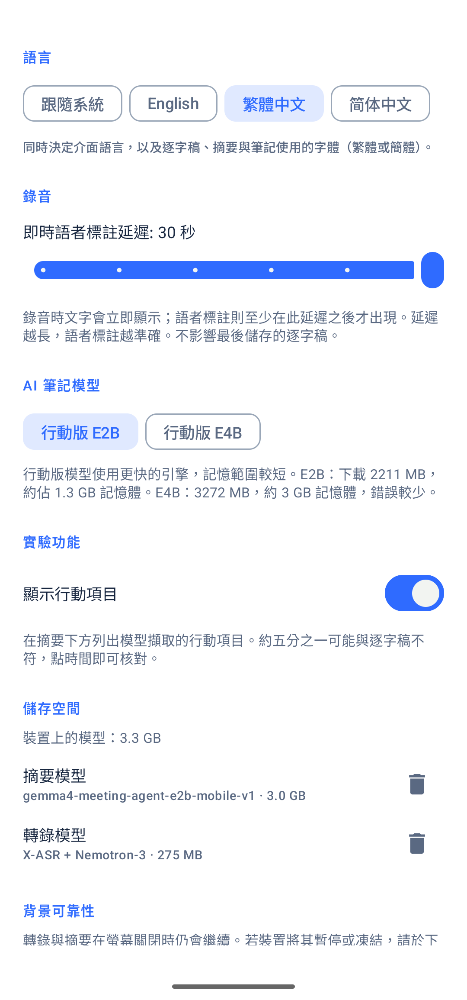
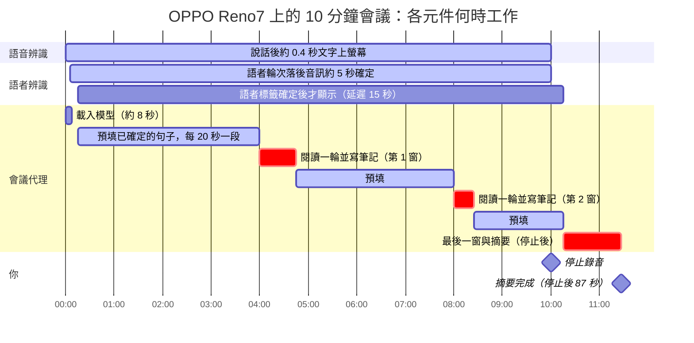

<p align="center">
  
</p>

<h1 align="center">VoxSum for Android</h1>

<p align="center">
  <b>會議錄音 → 標註語者的逐字稿 → 摘要。<br>全程在手機上完成，完全離線。</b>
</p>

<p align="center">
  <a href="https://github.com/vieenrose/VoxSumDroid/releases/latest"></a>
  
  
</p>

<p align="center"></p>

## 特色

- **完全離線、無帳號**：音訊不離開手機，模型首次使用時下載一次。
- **即時逐字稿與語者**：說話約 0.4 秒後文字上螢幕，語者在同一條串流中標註（AMI / AISHELL-4 語者歸屬正確率 95.4% / 92.3%）。
- **邊開會邊寫摘要**：會議代理在錄音時閱讀逐字稿並寫下筆記；停止後約 1.5 分鐘完成段落式摘要，每個時間點一下就播放。
- **錄音不會遺失**：停止即存檔，可連場錄音、稍後批次處理。
- **可編輯、可匯出**：修正文字與語者；匯出 `.m4a`、PDF、Markdown 或字幕。

## 使用

示範會議：AISHELL-4 L_R004S02C01（CC BY-SA 4.0）。

### 錄音

<p align="center"></p>

逐字稿即時出現；語者確定後，每句左側會有該語者的顏色與時間，尚未確定的句子為淺灰。上方的會議代理卡片顯示它正在聆聽或撰寫，以及距離下一次閱讀的進度。**下一場**存檔並立刻開始下一場，**停止並儲存**存檔後在背景處理。

### 會議代理

<p align="center"></p>

最新的片段在最上面，正在寫的筆記逐字出現。每則筆記標示類型（決議、待辦、提議、未決、數字）與時間；決議、待辦與數字另有「核對」，點一下跳到原話。較早片段的筆記收合為「+n 則筆記」。

### 摘要

<p align="center"></p>

段落式摘要，每個藍色時間點一下即從該處播放；下方是各語者的發言比例。行動項目為實驗功能，預設隱藏，可在「設定 → 實驗功能」開啟，開啟後列在摘要下方。

### 逐字稿

<p align="center"></p>

依語者上色的完整逐字稿，場次標題顯示在頂端，點一下即可修改。點任一句即跳到該處播放，目前播放的句子會高亮；每句的 **⋮** 可修改文字或改派語者。

### 重新處理

<p align="center"></p>

場次右上 **⋮** 可**重新轉錄**（重跑語音辨識與語者分離）或**重新摘要**（只重跑會議代理，逐字稿保留；修改逐字稿後也會提示）。同一選單還有「匯出與分享」與「設定」。

### 匯入

<p align="center"></p>

首頁的 **＋** 可加入裝置上的音訊檔、現場錄音、Podcast 單集、YouTube 影片，或重新開啟先前儲存的 `.ogg` / `.m4a` 工作階段。也可從其他 App 把音訊分享給 VoxSum。

### 匯出

<p align="center"></p>

場次右上 **⋮** →「匯出與分享」，各格式皆可儲存或分享：

- **VoxSum 工作階段（.m4a）**：音訊、逐字稿、語者、摘要與行動項目合為一檔，可在 VoxSum 重新開啟，任何播放器都能播放。
- **文件**：PDF、Markdown、純文字。
- **字幕**：SRT、VTT、LRC，含語者標籤。

### 設定

<p align="center"></p>

外觀（自動、淺色、深色、電子紙）、語言（跟隨系統、English、繁體中文、简体中文；介面與逐字稿、摘要、筆記的字體一起即時切換）、即時語者標註延遲（5–30 秒，越長越準確，不影響儲存的逐字稿）、模型用量與刪除、背景執行的電池設定。

## 安裝

從 [**Releases**](https://github.com/vieenrose/VoxSumDroid/releases/latest) 下載 APK。

- Android 8.0 以上，ARMv8.2（dotprod）處理器，約 2019 年後的手機。
- 模型：語音引擎約 275 MB，會議代理約 3.35 GB。
- RAM 8 GB 以上時代理在錄音中同步閱讀；較小的手機在錄音結束後閱讀。
- 唯一的網路請求：下載模型，以及每天一次檢查新版本。

## 已知限制

- 摘要模型以中文會議訓練，英文會議也會寫出中文摘要。
- 約 18% 的筆記敘述與逐字稿不符（上游量測），點時間即可核對。
- 偶爾會多分出一位發言很少的語者，可用「合併語者」修正。

## 運作方式

兩個元件在手機上同時運作：

- **聽寫**：[nemo-x-asr-diarizer](https://github.com/vieenrose/nemo-x-asr-diarizer.cpp) 是單一串流引擎，同一條時間軸上完成語音辨識（X-ASR）與語者分離（Nemotron-3）。
- **摘要**：[Gemma-4-E2B 會議代理](https://huggingface.co/Luigi/gemma-4-E2B-meeting-agent-zh-GGUF) 在 [llama.cpp](https://github.com/ggml-org/llama.cpp) 上執行，邊聽邊讀、邊寫筆記。

下圖是 RAM 8 GB 以上的手機錄一場 10 分鐘會議時，各元件何時工作：



如何閱讀這張圖：

- **語音辨識優先。** 它是唯一落後就會漏掉音訊的元件，所以代理讓出算力。
- **代理大多在預填。** 大家說話時，代理在背景把已確定的句子讀進上下文；每約 4 分鐘的語音才做一次真正的閱讀，手機上約 17–45 秒。
- **只讀已確定的句子。** 語者還可能改變的句子不會被讀到。
- **停止後只剩最後一窗。** 因此摘要在錄音結束後很快完成。
- **RAM 較小的手機** 則在錄音結束後才讀，流程相同。

在 OPPO Reno7（8 GB）上，10 分鐘會議的摘要於錄音結束後 87 秒完成，記憶體峰值 3.0 GB。模組對應見 [`docs/ARCHITECTURE.md`](docs/ARCHITECTURE.md)，準確度評測見 [`tools/nemo-eval`](tools/nemo-eval/README.md)。

## 從原始碼建置

需要 Android Studio、SDK 35、NDK 27.2：

```bash
git clone https://github.com/vieenrose/VoxSumDroid.git && cd VoxSumDroid
git submodule update --init           # 不要加 --recursive
./gradlew :app:assembleDebug          # arm64-v8a；模擬器用 -PvoxsumAbi=x86_64
./gradlew :app:testDebugUnitTest
scripts/test-on-device.sh             # 裝置上的儀器測試（獨立 app ID，不影響正式版）
```

## 授權

應用程式以 [GPL-3.0-or-later](LICENSE) 授權。使用的模型各依其授權：

| 元件 | 授權 |
|---|---|
| VoxSum（本專案） | GPL-3.0-or-later |
| X-ASR（語音辨識） | Apache-2.0 |
| Nemotron-3 Diarization（語者分離） | OpenMDW-1.1 |
| Gemma-4-E2B 會議代理（摘要） | Apache-2.0 |

示範音訊：AISHELL-4（CC BY-SA 4.0）、AMI（CC BY 4.0）。
