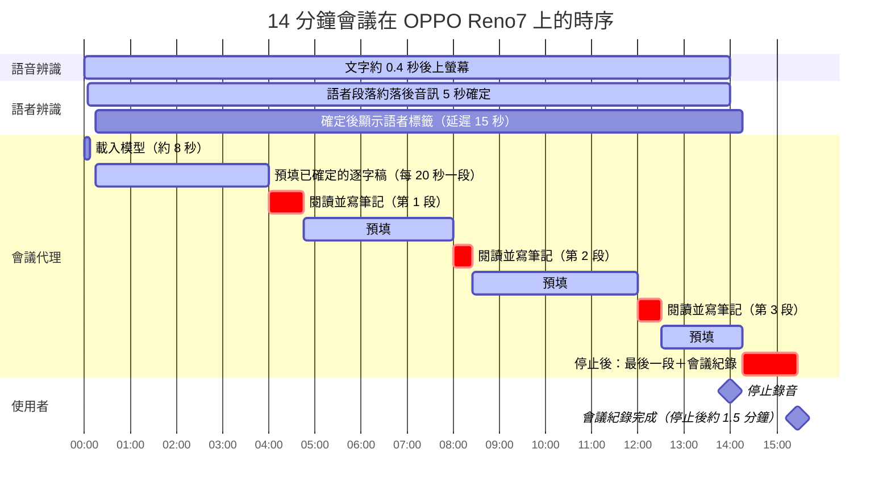

<p align="center">
  
</p>

<h1 align="center">VoxSum for Android</h1>

<p align="center">
  <b>把任何聲音，變成標註語者的逐字稿與精簡摘要 —<br>全程在手機上完成，完全離線。</b>
</p>

<p align="center">
  <a href="https://github.com/vieenrose/VoxSumDroid/releases/latest"></a>
  
  
  
</p>

<p align="center"><a href="README.md">English →</a></p>

---

錄一場會議、打開一段語音備忘、丟進一集 Podcast 或一條 YouTube 連結 —— VoxSum 會幫你寫出**誰說了什麼**，
再用你選的語言給出一份**精簡摘要**。一切都在**裝置端**完成：無需帳號、無需雲端、無需訂閱，聲音也永遠不會離開你的手機。

VoxSum 是一間**錄音工作室**：首頁就是你的**場次清單**，每段錄音在**停止的瞬間即自動儲存**（當機或誤觸再也弄不丟任何錄音），而且**錄音永遠不用等待處理** —— 一整天連場錄下去，再讓 App 逐一轉錄與摘要，每個場次的即時狀態一目了然。

> 剛接觸嗎？**[5 分鐘快速上手 →](docs/QUICKSTART.zh-TW.md)** 帶你走過每一項功能。

<p align="center"></p>
<p align="center"><i>開啟已完成的場次：摘要、依語者標註的逐字稿，點任一行即播放並同步高亮目前句子。</i></p>

## 為什麼選擇 VoxSum

- 🛡️ **絕對隱私** —— 音訊永遠不離開手機，機密錄音不會外洩到雲端。
- ✈️ **完全離線** —— 設定完成後即無需網路：在飛機、高鐵，或任何收不到訊號的地方都能用。
- 💰 **無需訂閱** —— 一次擁有，永久使用。沒有用量計費，也沒有月費。

## 螢幕截圖

<p align="center">
  
  
  
  
</p>
<p align="center"><i>工作室首頁（帶即時狀態的場次清單） · 帶語者的即時逐字稿 · 摘要 · 摘要語言選擇 —— 截圖為英文介面；App 亦提供繁體中文介面。</i></p>

## 你可以做什麼

**🎛️ 像工作室一樣運作**
- **首頁就是場次清單** —— 每段錄音都帶即時狀態：「未處理 · 排隊中 · 處理中（含階段與進度） · 已完成」。
- **連場錄音** —— 全螢幕錄音室：大字計時器、麥克風音量條，以及兩顆巨大按鈕 —— **⏭ 下一場**結束本場並立刻開始下一場（處理延後執行）；**⏹ 停止並儲存**先儲存、再於背景處理，你隨時可以再錄。
- **錄音絕不會弄丟** —— 麥克風一停，音訊立即存入資料庫，就算當機或誤觸也不受影響；完成的場次會自動把逐字稿＋摘要封裝進一個獨立的 `.m4a`。
- **想什麼時候處理都行** ——「處理待辦（n）」在背景轉錄、辨識語者、摘要並命名每段已儲存的錄音。批次處理**很有效率**：先把全部場次轉錄完，再**只載入一次**摘要模型處理整批 —— 佇列在 App 被殺後會自動接續，已完成的轉錄絕不重做。
- **管理你的檔案** —— 點按或長按任何場次：「立即處理 · 重新命名 · 分享音訊 · 刪除」—— 排隊中的場次另有「從佇列移除」，處理中的場次則有「停止處理」。錄音時就能命名場次 —— 你取的名字永遠優先於 AI 產生的標題。

**🎙️ 從各種來源匯入音訊**
- **裝置上的檔案** —— 支援多數常見的音訊與影片格式。
- **從其他 App 分享進來** —— 從 LINE、錄音 App 或瀏覽器，把語音訊息或音訊／影片檔直接分享給 VoxSum，立即開始轉錄。
- **即時錄音** —— 一邊說話一邊看逐字稿逐句出現（錄音室底部可收合的即時逐字稿），並有**麥克風音量條**。
- **Podcast** —— 搜尋、挑一集，直接轉成逐字稿。
- **YouTube 連結** —— 貼上網址，或用關鍵字搜尋。
- **重新開啟已存的工作階段** —— 點清單中任何「已完成」的場次，從上次離開的地方無縫接續。

**📝 閱讀與理解**
- **即時逐字稿** —— 話一說出口，句子就出現；轉錄還沒結束就能先讀、先播放。
- **誰在何時說話，即時標註** —— 語者在轉錄的同時就被辨識出來（同一次串流處理）：錄音時每一句就已依語者標註並以顏色區分，並自動偵測語者數量（最多 8 位）。在 AMI 與 AISHELL-4 會議語料上，時間加權語者歸屬正確率為 **95.4% / 92.3%**，且 **99%** 的語音都有標註語者（[詳細結果](tools/nemo-eval/README.md)）。VoxSum 還能**從談話內容推測語者的真實姓名**。
- **即時撰寫的會議紀錄** —— 錄音時，會議代理同步閱讀並寫下簡短筆記——**決議、待辦、未決事項、關鍵數字**——每則附可點播的時間；會議結束後約一分鐘紀錄即完成。中文可選**繁體中文**或**简体中文**顯示（預設依手機地區）。
- **行動項目與決議** —— 從會議中整理出「誰該做什麼」的待辦清單草稿與關鍵決議，可直接編輯。
- **搜尋逐字稿** —— 在長篇錄音中一鍵找出任何字詞；符合處會高亮，並可逐一切換。
- **與逐字稿同步的內建播放器** —— 像音樂播放器一樣固定在底部：點任一句即可跳到該處，播放時當下那一句會自動高亮。
- **護眼顯示** —— 提供**淺色**、**深色**，以及專為電子紙閱讀器（如 Boox）設計的扁平高對比**電子紙**主題。預設的**自動**會跟隨系統的明暗設定；可隨時在**設定 → 外觀主題**切換。

**✏️ 隨你編輯**
- **任意修改** —— 改一個字、重新命名語者、調整標題或摘要，都能直接在原處進行。
- **修正語者** —— 把標錯的句子改到正確的人，或把兩個語者合併為一個。
- 一鍵**複製**整段摘要。
- **匯出文字** —— 單一「**匯出與分享…**」面板，依你要的成品分組：**VoxSum 工作階段**（`.m4a`）、**文件**（**PDF**、**Markdown**、純文字，內含標題、摘要、待辦事項與含時間戳的逐字稿），或**字幕**（`.srt`／`.vtt`／`.lrc`，附語者標籤）。每一種都可**儲存或分享**，逐字稿也可一鍵複製。
- 隨時**重新執行**轉錄、摘要、**只重跑語者辨識**（「重新辨識語者」）或語者姓名偵測 —— 而且 VoxSum 會替你維持一致：編輯了逐字稿，App 會提示一鍵**重新摘要**，同時也會更新標題（除非標題是你自己寫的）。若只是在**繁體中文 ↔ 简体中文**之間切換，標題、摘要與逐字稿會**立即轉換**，無需重跑。
- **存成或分享為單一檔案** —— 整個工作階段（音訊＋逐字稿＋摘要＋語者＋封面）打包成一個 **`.m4a`**，**在任何播放器都能播**（並顯示標題、封面、摘要與作為歌詞的**同步逐字稿**——見[*Android 音樂播放器中的同步歌詞*](#android-音樂播放器中的同步歌詞)），**用 VoxSum 開啟時所有內容也完整保留**。（`.m4a` 相容性最廣——iPhone、車機、各種播放器；舊的 `.ogg` 工作階段仍可開啟。）

## 語言

- **轉錄**支援中文、英文，以及中英夾雜的語音。
- **摘要**以錄音的語言撰寫；中文可選繁體或簡體字。
- **App 本身**提供 **English、繁體中文** 兩種介面。

## 安裝

App **不**內建 AI 模型 —— 首次使用某功能時會下載一次，之後即可完全離線使用。有兩種安裝方式：

**透過 F-Droid（推薦 —— 自動更新）。** 在 F-Droid 用戶端中加入此軟體庫（**設定 → 軟體庫 → ➕**），
再從中安裝 VoxSum：

```
https://vieenrose.github.io/VoxSumDroid/repo?fingerprint=c9fe46eb7d87d4fa4e2340a73f78a602eafbab655cbe7c7cb4ead5ab7a00b088
```

 &nbsp; *（或掃描以加入軟體庫）*

這是自架軟體庫（非官方 f-droid.org 商店），加入為一次性步驟；之後更新就會自動送達。

**側載 APK。** 從 [**Releases 頁面**](https://github.com/vieenrose/VoxSumDroid/releases/latest)
下載最新的已簽署 APK 並開啟安裝（Android 可能會要求授權從瀏覽器或檔案管理器安裝）。

## 須知

- **首次執行會下載模型。** 第一次使用某項功能時，VoxSum 會從 **Hugging Face** 下載所需模型，
  驗證完整性後快取起來；之後就能完全離線。網路不穩時下載會**從中斷處續傳**；若模型檔損毀，VoxSum 會自動清除並提供一鍵**重試**。
- **小聲的錄音也沒問題。** 遠距或音量偏低的錄音會自動、不失真地提升音量 —— 轉錄、語者辨識與播放都受惠。
- **轉錄進行中**時，匯出與設定會暫時鎖定，避免存到只有一半的工作階段——完成後隨即解鎖。
- **唯一會送出的資料**，是每天最多一次、向 GitHub 查詢有無新版本的請求 —— 無任何追蹤，離線時自動略過。
  （F-Droid 用戶則由用戶端負責更新。）
- **支援 Android 8.0 以上**，需要支援點積指令的 ARMv8.2 處理器（大多數 2019 年以後的手機）。 一支具備幾 GB 可用空間的近代手機即可順暢運作。第一次轉錄會下載語音引擎的
  兩個模型（約 275 MB），第一次摘要會下載會議代理（約 3.35 GB）。RAM 約 8 GB 以上時兩者在錄音時同時運作
  （峰值約 3 GB）；RAM 較小時，代理在語音引擎釋放後才執行。

## 專案狀態

**語音引擎：單一串流流程（下一版起）。** 轉錄與語者辨識現在一起即時進行：
[nemo-x-asr-diarizer](https://github.com/vieenrose/nemo-x-asr-diarizer.cpp) 把 X-ASR 轉錄器與 NVIDIA 的
Nemotron-3 語者分離模型放在同一條音訊時間軸上，所以錄音時就能標註語者，不必等錄完再另外跑一次。它取代了先前的流程
（語音活動偵測＋X-ASR，再另外做語者分群），只適用於舊流程的設定也一併移除。

- **已驗證：** 在 22 場各 10 分鐘的 AMI 與 AISHELL-4 會議上，語者歸屬正確率持平（95.4% / 92.3%，先前為
  95.6% / 92.1%），有標註語者的語音比例從 81–89% 提升到 99%，語者分離錯誤率（DER）從 22% 降到 17%（AMI）與
  12%（AISHELL-4）。[完整結果](tools/nemo-eval/README.md)。
- **尚未驗證：** 手機上的速度與記憶體用量 —— 以上數字來自在桌機上執行的同一份引擎程式碼。在會議錄音中偶爾會多分出一位
  發言很少的語者，可用「合併語者至…」一鍵修正。

**摘要器：即時閱讀會議的代理（下一版起）。** 摘要在**會議進行中**就開始撰寫，由
[Gemma-4-E2B 會議代理](https://huggingface.co/Luigi/gemma-4-E2B-meeting-agent-zh-GGUF)（Apache-2.0，3.35 GB）
負責：語者確定後，逐字稿就逐句送入同一段持續延伸的對話；每累積約 2,000 tokens（約 4 分鐘），代理寫下最多五則
簡短、分類（決議、待辦、未決、數字）並附引用時間的筆記。停止後，同一模型依這些筆記寫成段落式摘要（只保留與筆記相符的時間，每個 `[時間]` 點一下就播放）；待辦即 ACTION 筆記。


三條流程同時運作。語音辨識優先——落後就會遺失音訊——所以代理在大家說話時於背景預填，只在每約 4 分鐘的語音後做一次真正的
閱讀（手機上 17–45 秒）。它不會讀到語者仍可能改變的句子；停止錄音時，只剩最後一段要讀。

錄音時三條流程同時運作：語音辨識、語者辨識與代理；錄音畫面同時顯示即時逐字稿、確定後的語者標籤，以及代理的狀態、
正在寫的筆記與最新筆記（完整活動紀錄在工作階段畫面）。

- **已在 OPPO Reno7（Dimensity 900、8 GB）驗證**：10 分鐘會議以即時速度重播、三條流程並行，語音辨識最多落後
  6.5 秒且未遺失音訊，會議紀錄在音訊結束後 **87 秒**完成，記憶體峰值 3.0 GB。
- **品質（上游量測，38 場 zh-TW 會議）**：涵蓋率 0.91、決議召回 77%，但約 **18% 的敘述與逐字稿矛盾**——
  App 將其標示為筆記而非正式紀錄，點時間即可核對。
- **限制**：模型以中文（立法院）會議訓練，英文會議也會寫出中文筆記；即時模式需約 8 GB RAM，較小的手機則在錄音結束後才閱讀。

## Android 音樂播放器中的同步歌詞

匯出的 `.m4a` 會把標題、封面、**摘要**（存在*註解 comment* 標籤）以及
**逐行同步的逐字稿**（存在*歌詞 lyrics* 標籤，以 LRC `[mm:ss.xx]` 格式）寫成中繼資料。
能解析**同步歌詞**的 Android 播放器會隨播放**即時捲動**逐字稿——直接從檔案讀取，**不需旁檔、不需權限**。
（不支援同步的播放器會直接顯示文字，並帶有 `[mm:ss]` 時間軸。）

| 程式 | 在哪裡打開歌詞 | 即時同步 |
|---|---|---|
| **Retro Music** *(免費)* | 播放畫面歌詞（歌詞） | ✅ |
| **Gramophone** *(免費)* | 歌詞檢視 | ✅ |
| **Musicolet** *(免費)* | 點封面 → 顯示歌詞 | ✅ |

<p align="center">

&nbsp;
&nbsp;
</p>

*在 Pixel 上同步捲動的逐字稿——**Retro Music**、**Gramophone**、**Musicolet**（目前播放的那一行會隨之高亮）。*

> **備註。** 以上三款都已在 Pixel 驗證——目前播放的那一行會隨之高亮。**摘要**也存在標準的**註解（comment）**標籤。
> 也可另外匯出 **`.lrc` 旁檔**（**匯出與分享… → 字幕 → LRC**），供偏好旁檔的播放器使用。

## 給開發者

VoxSum 是 [VoxSum Studio](https://huggingface.co/spaces/Luigi/VoxSum-bak) 的裝置端移植版，語音辨識與語者分離由
[nemo-x-asr-diarizer](https://github.com/vieenrose/nemo-x-asr-diarizer.cpp) 以單一串流流程完成（X-ASR ＋ Nemotron-3 Diarization），
摘要由 [llama.cpp](https://github.com/ggml-org/llama.cpp) 執行，全部在本機運行、由原始碼建置。模組對應請見
[`ARCHITECTURE.md`](ARCHITECTURE.md)；建置步驟見[英文說明](README.md#build-from-source)。

## 授權

[GPL-3.0-or-later](LICENSE)。內含的原始碼相依套件各自保留其授權；下載的模型各依其授權：
X-ASR（Apache-2.0）、Nemotron-3 Diarization（OpenMDW-1.1），摘要模型見 `LlmRegistry.kt`。
