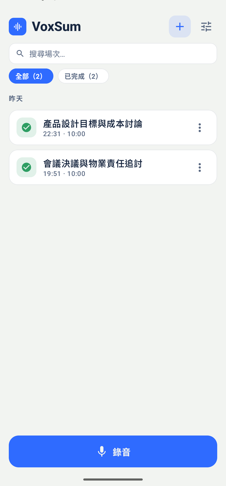
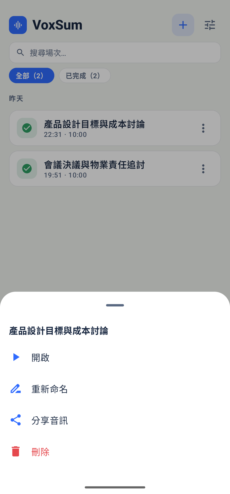
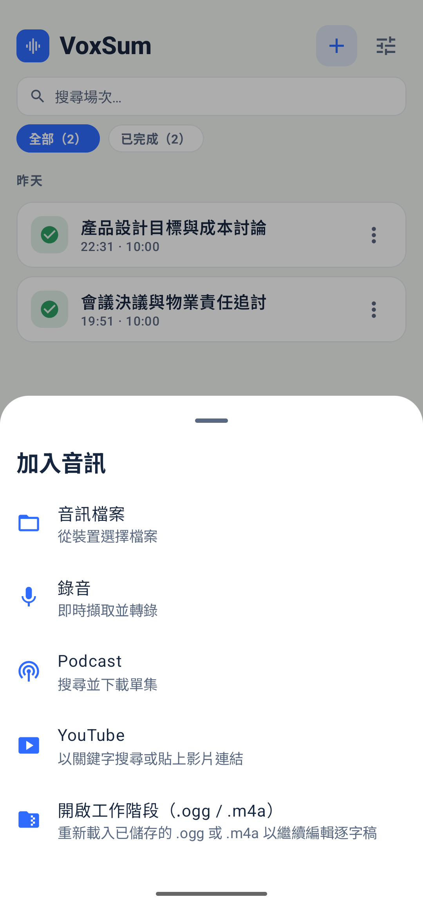
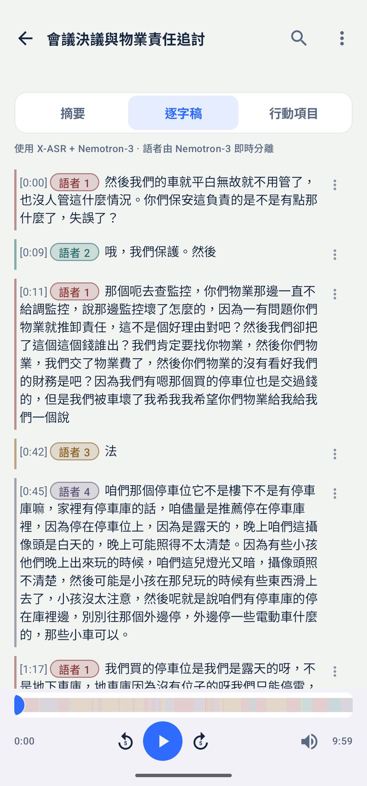
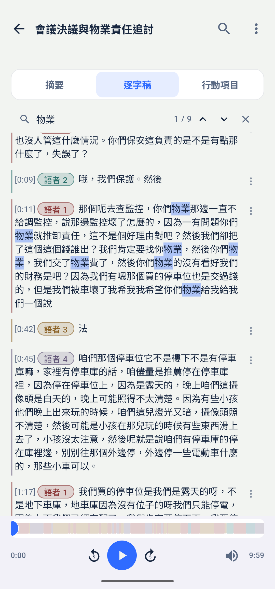
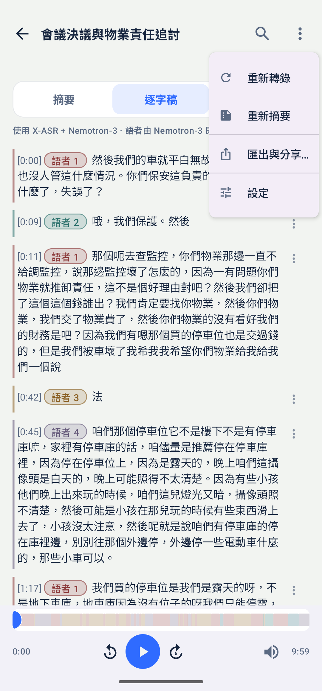
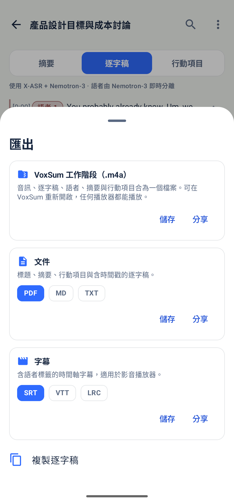
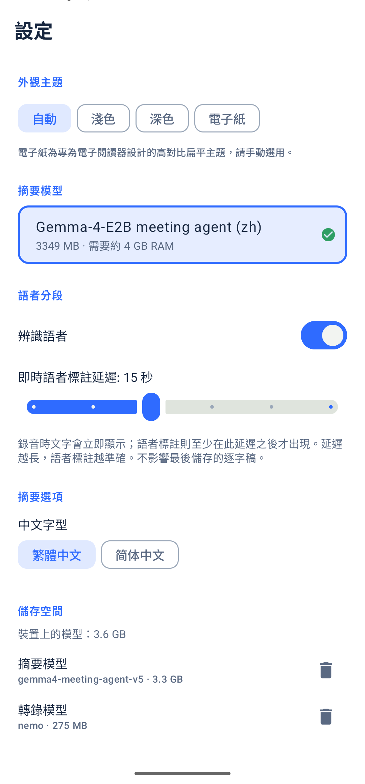
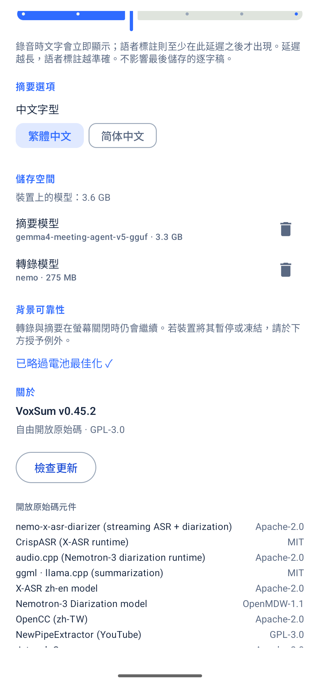

  

<h1 align="center">VoxSum — 快速上手</h1>

<a href="../README.md">← 回到說明文件</a>

---

五分鐘看完 VoxSum 的主要功能。無需帳號；模型首次使用時下載一次（語音引擎約 275 MB、會議代理約 3.35 GB），之後完全離線。

## 1. 首頁

場次清單：每段錄音都標示狀態（未處理、排隊中、處理中、已完成）。點 **錄音** 開始，點 **＋** 匯入音訊。

## 2. 錄音

- 說話後約 0.4 秒，文字即出現在即時逐字稿。
- 語者確定後（預設 15 秒），每句左側出現該語者的顏色與時間；尚未確定的句子以淺灰顯示。
- 上方的**會議代理**卡片顯示它正在聆聽或撰寫筆記，以及距離下次閱讀的進度。
- **⏭ 下一場**：存檔並立刻開始下一場（稍後再處理）。**⏹ 停止並儲存**：存檔並在背景處理。
- 麥克風一停，錄音即已存檔，當機或誤觸都不會遺失。

## 3. 管理與匯入

  
  &nbsp;
  

- 點場次的 **⋮**：開啟、重新命名、分享音訊、刪除。
- **＋ 加入音訊**：裝置上的音訊檔、錄音、Podcast、YouTube，或重新開啟 `.m4a` 工作階段。也可從其他 App 把音訊分享給 VoxSum。
- 未處理的場次可一次批次處理；摘要模型只載入一次。

## 4. 摘要與會議代理

  
  &nbsp;
  

- **會議代理**邊聽邊寫筆記，分為決議、待辦、提議、未決、數字；最新的片段在最上面。
- 決議、待辦與數字標有 **核對**：點一下即跳到原話。約五分之一的筆記可能與逐字稿不符。
- 會議結束後約 1.5 分鐘，代理把筆記寫成段落式摘要；每個藍色時間點一下即從該處播放。下方是各語者的發言比例。

## 5. 逐字稿與搜尋

  
  &nbsp;
  

- 依語者標註顏色的逐字稿；點任一句即跳到該處播放，播放時目前的句子會高亮。
- 每句的 **⋮**：編輯文字、把這句改給另一位語者，或合併兩位語者。點語者標籤可改名。
- 點 🔍 搜尋，符合處高亮，可逐一切換。

## 6. 重新執行與匯出

  
  &nbsp;
  

- 右上 **⋮**：重新轉錄、重新摘要；行動項目隨摘要一併產生。
- **匯出與分享**：
  - **VoxSum 工作階段（.m4a）**：音訊、逐字稿、語者、摘要合為一檔，可在 VoxSum 重新開啟，任何播放器都能播放。
  - **文件**：PDF、Markdown、純文字。
  - **字幕**：SRT、VTT、LRC。

## 7. 設定

  
  &nbsp;
  

- **外觀主題**：自動、淺色、深色、電子紙。
- **即時語者標註延遲**（5–30 秒）：越長越準確，不影響儲存的逐字稿。
- **中文字型**：繁體或簡體；切換後標題、摘要、逐字稿立即轉換。
- **儲存空間**：各模型的磁碟用量，可刪除（下次使用時重新下載）。

---

<i>示範會議：AISHELL-4 L_R004S02C01（CC BY-SA 4.0）、AMI ES2004a（CC BY 4.0）。</i>

