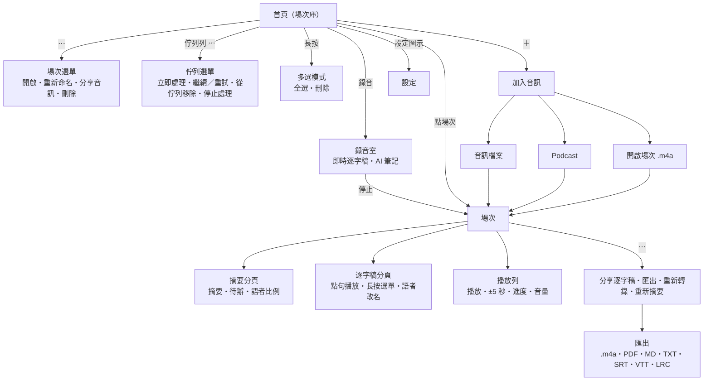

# VoxSum iOS 使用說明（含介面測試地圖）

結構與 [Android 版使用說明](https://github.com/vieenrose/VoxSum/blob/android/docs/USER_GUIDE.md) 相同：

- **使用說明**：每一節介紹一個畫面。
- **測試地圖**：每一節最後的表格列出該畫面上的每個操作（節點）、進入方式、預期結果與驗證狀態。

驗證欄：✅ 手動＝在 iPhone 14 Pro Max 上實際操作確認；⬜＝尚未在實機驗證（已編譯）。截圖之後補上。
與 Android 的差異：沒有 YouTube、App 內更新、GPU／NPU 選項與中斷復原對話框（佇列會自動接續）。

畫面結構：

---

## 1. 首頁（場次庫）

所有錄音與匯入的場次依日期（今天、昨天、日期）分組。上方可搜尋標題並以晶片篩選；沒有場次時顯示說明（隱私、離線、免費）。底部的 **錄音** 開始一場新會議。排入佇列或處理中的項目列在最上方。

| 節點 | 如何到達 | 預期結果 | 驗證 |
|---|---|---|---|
| 搜尋 | 首頁上方輸入框 | 依標題篩選；沒有結果時顯示「沒有符合搜尋的場次」 | ⬜ |
| 篩選晶片 全部／已完成 | 有場次時 | 只列出該狀態的場次 | ⬜ |
| 點場次 | 點一列 | 開啟場次（第 5 節） | ✅ 手動 |
| 錄音 | 底部按鈕 | 首次要求麥克風權限；拒絕時顯示「需要麥克風權限」；允許後進入錄音室（第 4 節） | ✅ 手動 |
| ＋ | 右上 | 加入音訊（第 3 節） | ✅ 手動 |
| 設定圖示 | 右上 | 設定（第 8 節） | ✅ 手動 |
| 下載列 | 模型下載中 | 名稱、進度與取消 | ✅ 手動 |

## 2. 場次與佇列選單

場次列右側的 **⋯**：

| 節點 | 何時出現 | 預期結果 | 驗證 |
|---|---|---|---|
| 開啟 | 一律 | 開啟場次 | ⬜ |
| 重新命名 | 一律 | 對話框輸入新標題 | ⬜ |
| 分享音訊 | 有音訊檔 | 系統分享面板 | ⬜ |
| 刪除 | 一律 | 確認對話框；取消不刪 | ⬜ |
| 長按 → 多選 | 長按一列 | 勾選多列，全選、批次刪除（需確認） | ⬜ |

佇列列（處理中、排入佇列、已停止、失敗）右側的 **⋯**：

| 節點 | 何時出現 | 預期結果 | 驗證 |
|---|---|---|---|
| 停止處理 | 正在處理 | 停止，列顯示「已停止，可繼續」 | ✅ 手動 |
| 繼續 | 已停止 | 從檢查點接續；已完成的轉錄不重做 | ⬜ |
| 重試 | 處理失敗（列上顯示錯誤） | 重新處理；失敗時也會發出通知 | ⬜ |
| 立即處理 | 排入佇列、尚未處理 | 移到最前並開始 | ⬜ |
| 從佇列移除 | 未在處理 | 移出佇列 | ⬜ |

App 被終止或離開時，佇列由背景工作（`BGProcessingTask`）或下次啟動時接續。

## 3. 加入音訊

| 節點 | 預期結果 | 驗證 |
|---|---|---|
| 音訊檔案 | 「檔案」挑選器；複製時顯示「正在匯入分享的音訊…」，完成後排入佇列；失敗時顯示「匯入失敗」 | ✅ 手動 |
| Podcast | 搜尋節目 → 選集 → 下載後排入佇列 | ✅ 手動 |
| 開啟場次 | 選 VoxSum 場次 `.m4a`（Android 匯出的也可以）：直接還原逐字稿、語者與摘要，不重新轉錄 | ✅ 手動 |
| 從其他 App 分享 | 分享音訊到 VoxSum | 同「音訊檔案」 | ⬜ |

## 4. 錄音室

錄音前就把錄音排入佇列，App 被終止也保留音訊。錄音時套用自動增益（只放大小聲的語音），逐字稿即時出現；語者在設定的延遲後標上顏色。AI 筆記卡片顯示閱讀狀態；RAM 不足 4.5 GB 時，AI 筆記在錄音結束後才閱讀。

| 節點 | 預期結果 | 驗證 |
|---|---|---|
| 計時與即時逐字稿 | 逐字稿隨說話更新 | ✅ 手動 |
| AI 筆記卡片 | 閱讀中／寫筆記；展開可看每則筆記 | ✅ 手動 |
| 停止 | 存檔、轉錄、摘要並取標題；完成後通知「場次已就緒」 | ✅ 手動 |

## 5. 場次：摘要分頁

| 節點 | 預期結果 | 驗證 |
|---|---|---|
| 摘要卡片 | 超過 12 行時「顯示更多／顯示較少」 | ✅ 手動 |
| 編輯（筆形） | 編輯摘要後儲存 | ✅ 手動 |
| 複製 | 複製摘要，提示「已複製摘要」 | ⬜ |
| 時間點 | 點藍色時間點從該處播放（支援 `[mm:ss]` 與 `[h:mm:ss]`） | ⬜ |
| 待辦事項 | 開啟「顯示待辦事項」時出現；超過 8 行可展開；可複製 | ✅ 手動 |
| 沒有摘要 | 顯示「沒有偵測到語音」或「尚無摘要」說明 | ⬜ |
| 沒有可記的內容 | 摘要只有一行「這段錄音沒有需要記下的事項」 | ⬜ |
| 模型已更換 | 開啟以舊模型摘要的場次時，提示重新摘要 | ⬜ |

## 6. 場次：逐字稿分頁

上方註明處理流程（X-ASR + Nemotron-3 語者分離）。

| 節點 | 預期結果 | 驗證 |
|---|---|---|
| 點一句 | 從該處播放 | ✅ 手動 |
| 長按 → 編輯 | 修改文字並儲存 | ⬜ |
| 長按 → 移給語者 | 這句改派給另一位語者 | ⬜ |
| 長按 → 合併語者 | 該語者全部併入另一位 | ⬜ |
| 語者改名 | 點語者名稱 | ⬜ |
| 修改後 | 有摘要時提示「逐字稿已變更，要重新摘要嗎？」 | ⬜ |

## 7. 播放列與場次選單

| 節點 | 預期結果 | 驗證 |
|---|---|---|
| 播放／暫停、±5 秒、進度 | — | ✅ 手動 |
| 音量 | 靜音、25／50／75／100% | ✅ 手動 |
| ⋯ → 分享逐字稿 | 系統分享面板（純文字） | ⬜ |
| ⋯ → 匯出 | 選格式；`.m4a` 場次匯出時顯示「匯出中」；失敗時提示 | ✅ 手動 |
| 匯出格式 | TXT（略過空行）、MD（標題、摘要、逐字稿條列）、SRT／VTT（每段 ≤32 字）、LRC、PDF | ✅ 手動 |
| ⋯ → 重新轉錄 | 重跑語音辨識與語者分離 | ⬜ |
| ⋯ → 重新摘要 | 保留逐字稿與語者名稱；完成時畫面即時更新並顯示「新摘要已完成 · 復原」 | ✅ 手動 |

## 8. 設定

| 節點 | 預期結果 | 驗證 |
|---|---|---|
| 語言 | English／繁體中文／简体中文，介面與產生的文字一起切換 | ⬜ |
| 外觀 | 自動、淺色、深色、電子紙 | ✅ 手動 |
| 文字大小 | 整個 App 的文字縮放 | ⬜ |
| 語者標註延遲 | 5–30 秒（預設 15） | ⬜ |
| AI 筆記模型 | E2B（預設）或 E4B | ✅ 手動 |
| 硬體狀態列 | 顯示 CPU、記憶體等 | ⬜ |
| 推論執行緒 | 自動（首次一秒測試）或手動；載入失敗時自動降低 | ✅ 手動 |
| 顯示待辦事項 | 摘要分頁多一張待辦卡 | ✅ 手動 |
| 儲存空間 | 列出每個模型（含編譯快取大小），可刪除 | ✅ 手動 |
| 關於 | 版本、元件與授權 | ⬜ |
