# VoxSum 使用說明（含介面測試地圖）

這份文件有兩個用途：

- **使用說明**：每一節介紹一個畫面，附截圖。
- **測試地圖**：每一節最後的表格列出該畫面上的每個操作（節點）、進入方式、預期結果與驗證狀態，作為介面測試的清單。

驗證欄：✅ 手動＝在模擬器或實機上實際操作確認；✅ 自動＝由 `app/src/androidTest` 的儀器測試涵蓋（括號內為測試類別）；⬜＝尚未驗證。最後一次全面驗證：2026-10-03，v0.47.0，Pixel 模擬器（8 GB）與 Galaxy Note 10+。

畫面結構：

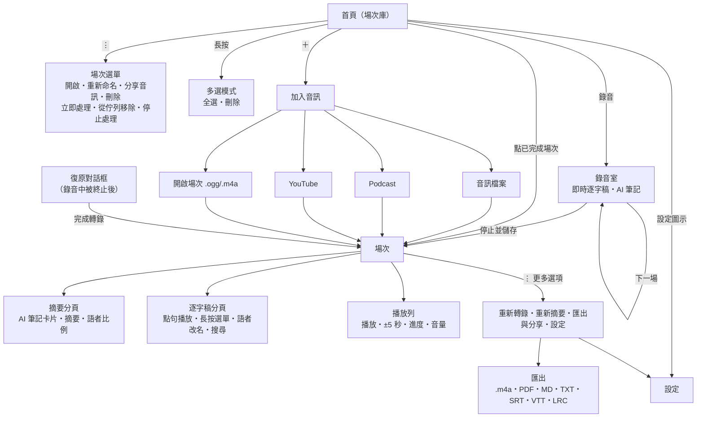
```mermaid
flowchart TD
    Home["首頁（場次庫）"]
    Home -->|"⋮"| RowMenu["場次選單<br/>開啟・重新命名・分享音訊・刪除<br/>立即處理・從佇列移除・停止處理"]
    Home -->|長按| Select["多選模式<br/>全選・刪除"]
    Home -->|＋| Add["加入音訊"]
    Add --> File["音訊檔案"]
    Add --> Podcast["Podcast"]
    Add --> YouTube["YouTube"]
    Add --> Open["開啟場次 .ogg/.m4a"]
    Home -->|設定圖示| Settings["設定"]
    Home -->|錄音| Booth["錄音室<br/>即時逐字稿・AI 筆記"]
    Booth -->|下一場| Booth
    Booth -->|停止並儲存| Session
    Home -->|點已完成場次| Session["場次"]
    File --> Session
    Podcast --> Session
    YouTube --> Session
    Open --> Session
    Session --> Summary["摘要分頁<br/>AI 筆記卡片・摘要・語者比例"]
    Session --> Transcript["逐字稿分頁<br/>點句播放・長按選單・語者改名・搜尋"]
    Session --> Player["播放列<br/>播放・±5 秒・進度・音量"]
    Session -->|"⋮ 更多選項"| More["重新轉錄・重新摘要・匯出與分享・設定"]
    More --> Export["匯出<br/>.m4a・PDF・MD・TXT・SRT・VTT・LRC"]
    More --> Settings
    Recovery["復原對話框<br/>（錄音中被終止後）"] -->|完成轉錄| Session
```

---

## 1. 首頁（場次庫）

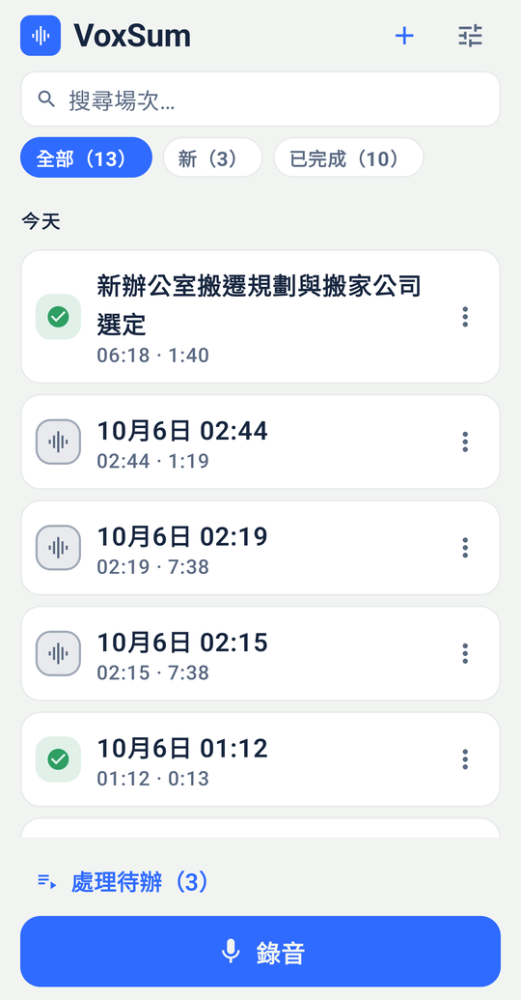

所有錄音與匯入的場次依日期分組列在這裡。上方可搜尋標題；有「新」場次（尚未處理）時會出現篩選晶片。底部的 **錄音** 開始一場新會議；有尚未處理的錄音時，上方會多一個 **處理待辦（N）**。

| 節點 | 如何到達 | 預期結果 | 驗證 |
|---|---|---|---|
| 搜尋場次… | 首頁上方輸入框 | 依標題篩選；沒有結果時顯示「沒有符合搜尋的場次。」 | ✅ 手動 |
| 篩選晶片 全部／新／已完成 | 有「新」場次時出現 | 只列出該狀態的場次；全部已完成時晶片不顯示 | ✅ 手動 |
| 點場次（已完成） | 點一列 | 開啟場次（第 6 節） | ✅ 手動 |
| 點場次（處理中） | 點正在處理的一列 | 即時查看處理進度 | ✅ 手動 |
| 處理待辦（N） | 有未處理錄音時 | 依序轉錄並摘要；完成後列變為已完成 | ✅ 手動（Note 10+） |
| 錄音 | 底部大按鈕 | 首次要求麥克風權限，進入錄音室（第 5 節） | ✅ 手動 |
| 錄音中…（返回） | 錄音進行中回到首頁 | 回到錄音室，錄音不中斷 | ✅ 手動 |
| ＋ | 右上 | 加入音訊選單（第 4 節） | ✅ 手動 |
| 設定圖示 | 右上 | 設定（第 9 節） | ✅ 手動 |
| 有可用更新橫幅 | 有新版本時 | 更新＝下載並安裝；稍後＝隱藏 | ⬜ |

## 2. 場次 ⋮ 選單

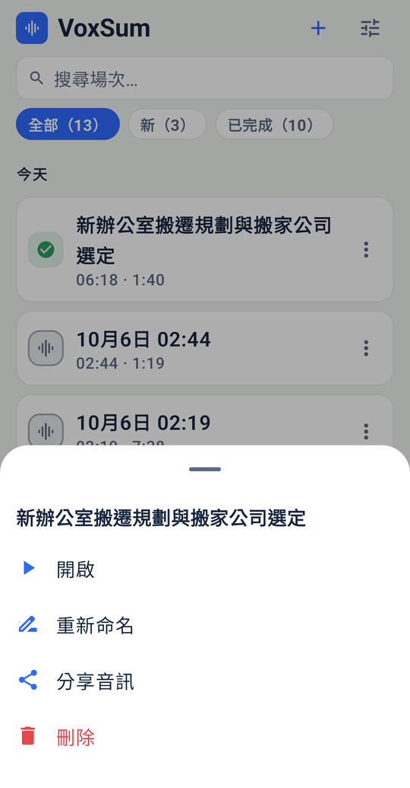 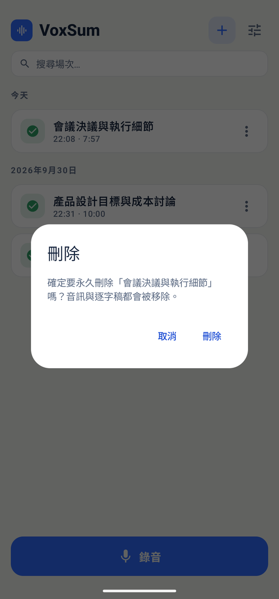

每列右側的 **⋮** 依場次狀態提供不同操作。

| 節點 | 何時出現 | 預期結果 | 驗證 |
|---|---|---|---|
| 開啟 | 已完成 | 開啟場次 | ✅ 手動 |
| 重新命名 | 一律 | 對話框輸入新標題，確定後列上標題更新（新場次的預設標題為日期時間，如「10月6日 00:11」，摘要完成後換成 AI 擬的標題） | ✅ 手動 |
| 分享音訊 | 一律 | 系統分享面板，附 `.m4a` | ✅ 手動 |
| 刪除 | 一律 | 確認對話框「確定要永久刪除「…」嗎？」；取消不刪 | ✅ 手動 |
| 繼續處理 | 處理被中斷（停止、App 被終止）且已留有進度 | 從已存的最後穩定段落接續語音辨識，語者編號與先前一致；已完成的部分不重做 | ✅ 手動 |
| 立即處理 | 未處理，或已排入佇列且沒有正在處理的項目 | 開始轉錄與摘要；在「停止」之後也能再次開始 | ✅ 手動 |
| 從佇列移除 | 已排入佇列、尚未處理 | 移出佇列，保留錄音（列變為「新」） | ✅ 手動 |
| 正在處理的場次 | 該列沒有 ⋮；點一下開啟即時畫面 | 即時畫面頂端的「停止」停止處理，該列回到「排入佇列」，稍後自動繼續 | ✅ 手動 |

處理中按下「停止」，或 App 被終止後，已轉錄的穩定段落與 AI 筆記會存下來。下次開啟時會詢問 **繼續中斷的場次？**，也可隨時從 ⋮ 選 **繼續處理**。匯入檔案時只能接續到已解碼的音訊為止（停止當下尚未解碼的部分不會保留）。

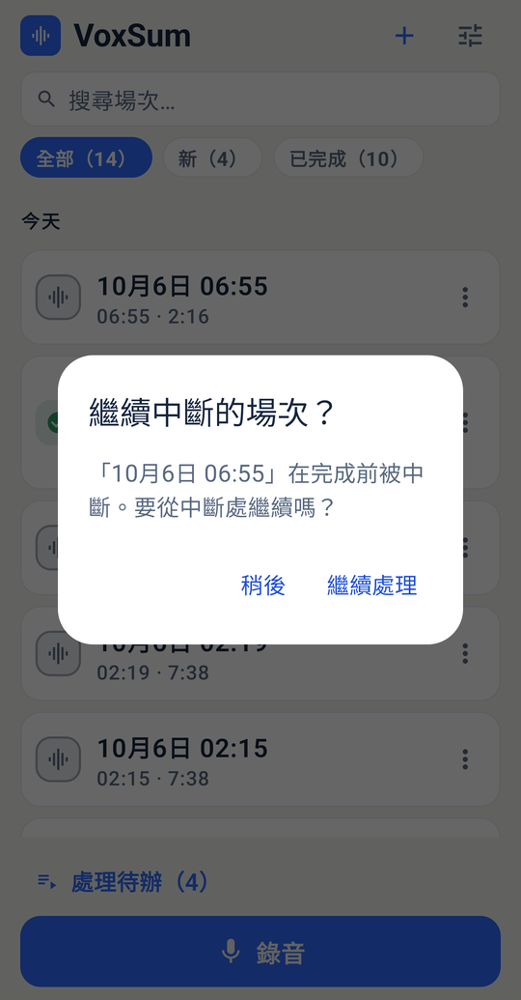 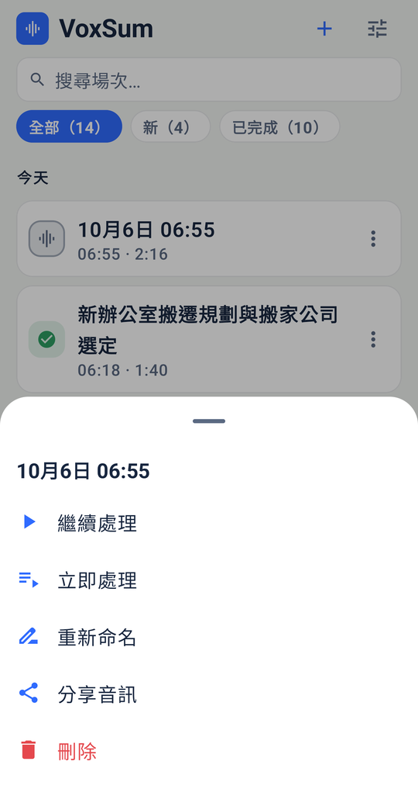

## 3. 多選模式

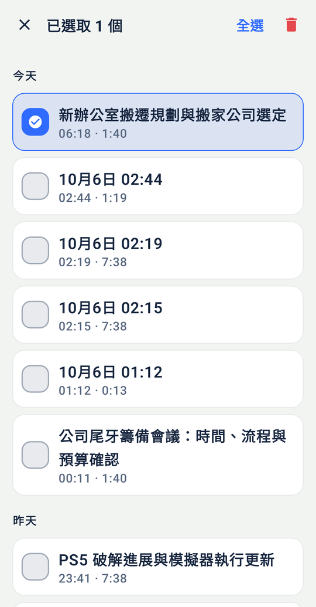 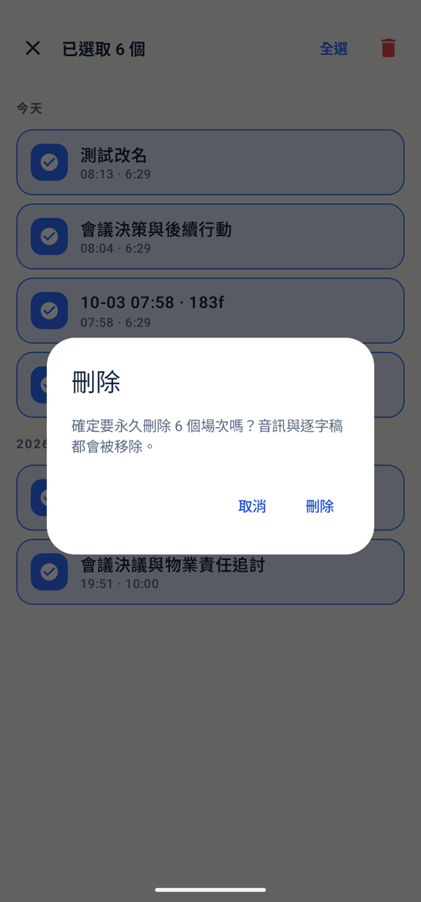

長按一列進入多選。

| 節點 | 如何到達 | 預期結果 | 驗證 |
|---|---|---|---|
| 長按場次 | 首頁 | 進入多選，標題列顯示「已選取 1 個」 | ✅ 手動 |
| 點其他場次 | 多選中 | 加入或取消選取 | ✅ 手動 |
| 全選 | 多選標題列 | 選取所有顯示中的場次 | ✅ 手動 |
| 刪除 | 多選標題列 | 「確定要永久刪除 N 個場次嗎？」確認後刪除 | ✅ 手動（確認框） |
| 結束選取（X） | 多選標題列 | 回到一般首頁 | ✅ 手動 |

## 4. 加入音訊

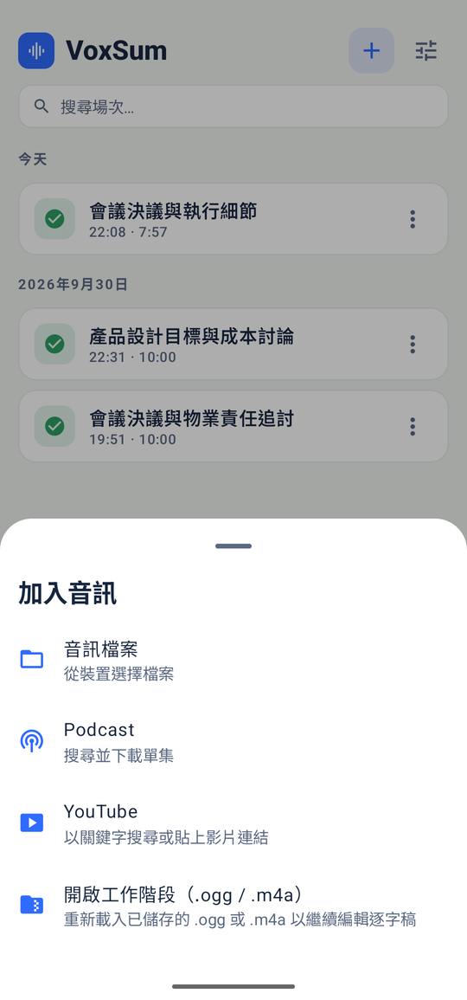 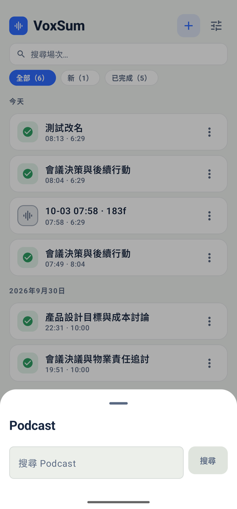 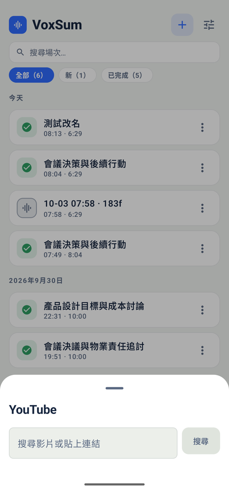

處理事先錄好的音訊。也可以從其他 App 把音訊「分享」給 VoxSum。

| 節點 | 如何到達 | 預期結果 | 驗證 |
|---|---|---|---|
| 音訊檔案 | ＋ → 音訊檔案 | 系統檔案選擇器；選取後轉錄並摘要（長時間的靜音會快速略過） | ✅ 手動、✅ 自動（AddSourceSheetTest） |
| Podcast → 搜尋 → 節目 → 轉錄 | ＋ → Podcast | 列出單集與長度，下載並轉錄所選單集 | ✅ 手動、✅ 自動（SourceSheetsTest，搜尋） |

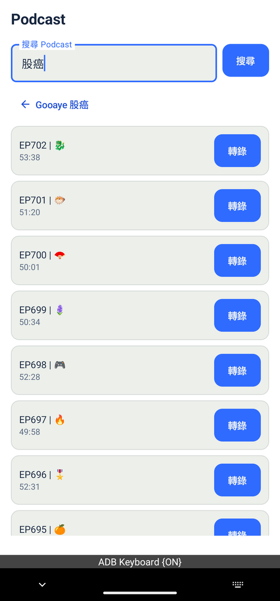
| YouTube → 搜尋或貼上連結 | ＋ → YouTube | 搜尋結果或直接前往影片，下載音訊並轉錄；直播顯示「直播無法轉錄，請選擇一般影片。」 | ✅ 手動、✅ 自動（SourceSheetsTest，搜尋） |
| 開啟場次（.ogg / .m4a） | ＋ → 開啟場次 | 開啟先前匯出的 VoxSum 檔，含逐字稿與摘要 | ✅ 手動、✅ 自動（AddSourceSheetTest） |
| 從其他 App 分享 | 其他 App → 分享 → VoxSum | 閒置時直接轉錄；處理中時詢問「匯入這個檔案？」（匯入會中斷處理） | ✅ 手動 |

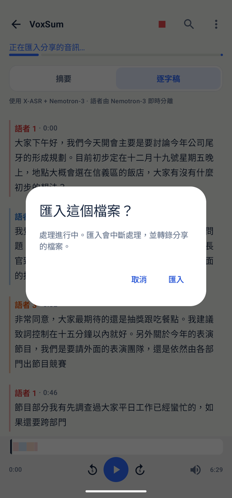

## 5. 錄音室

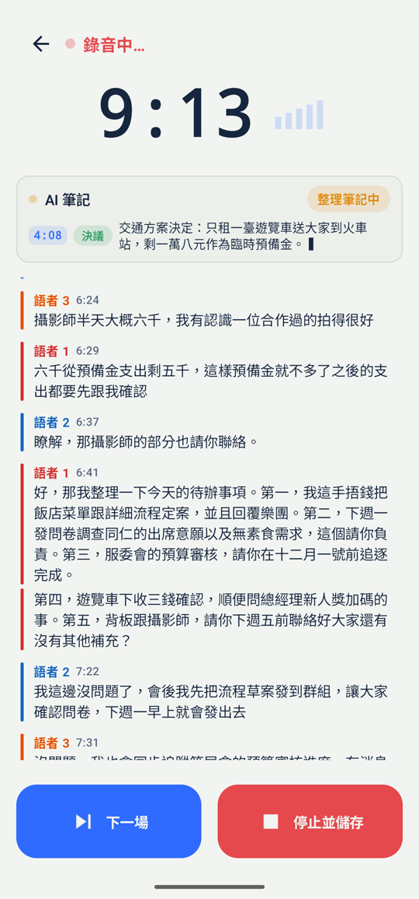 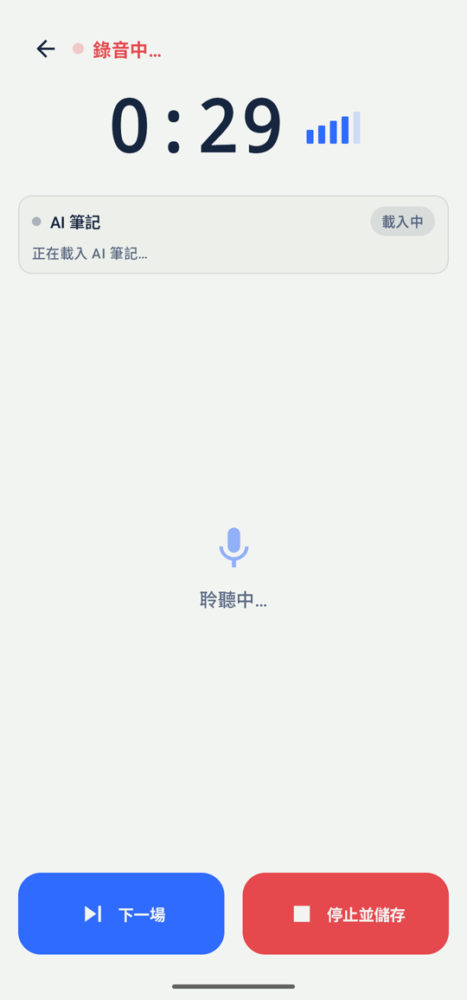

逐字稿在說話約 0.4 秒後出現；語者確定後標上顏色，尚未確定的句子為淺灰。上方 **AI 筆記** 卡片顯示它正在閱讀逐字稿或正在寫筆記（正在寫的筆記逐字出現）。AI 筆記每讀滿一段逐字稿（約 1,500 個詞元）才寫一批，所以第一則筆記要等幾分鐘才出現（示範會議約在第 6 分鐘），這是正常的。計時器下方的細條是硬體狀態列（CPU、GPU、記憶體、電池；「BAT +」表示充電中），數值過高時轉紅，可在設定中關閉。RAM 8 GB 以上的手機在錄音中同步閱讀；較小的手機在錄音結束後閱讀。第一次錄音時，模型下載的進度也顯示在這裡，麥克風在下載期間已開始錄音；下載後 AI 筆記模型會準備一次（「正在準備…（僅首次，約一分鐘）」）。

| 節點 | 如何到達 | 預期結果 | 驗證 |
|---|---|---|---|
| 計時器與音量條 | 錄音中 | 時間遞增，音量條隨聲音跳動 | ✅ 手動 |
| 硬體狀態列 | 錄音中、AI 筆記閱讀中 | 計時器下方與 AI 筆記卡片內顯示細條，每 2 秒更新；關閉設定後隱藏 | ✅ 手動（Note 10+） |
| 即時逐字稿 | 錄音中 | 文字即時出現，語者依序上色 | ✅ 手動（模擬器、Note 10+） |
| AI 筆記卡片 | 錄音中（8 GB 以上） | 閱讀逐字稿 → 整理筆記中，筆記逐字出現 | ✅ 手動 |
| 下一場 | 錄音中 | 存檔並立刻開始下一場；前一場自動處理 | ✅ 手動 |
| 停止並儲存 | 錄音中 | 存檔並開啟場次；AI 筆記讀完最後一段後寫摘要 | ✅ 手動 |
| 返回 | 左上 | 回首頁，錄音不中斷 | ✅ 手動 |
| 錄音失敗 | 例如語音引擎無法載入 | 顯示錯誤並回到首頁；已錄的音訊保留在「處理待辦」 | ✅ 手動（Note 10+，修正前後） |

## 6. 場次：摘要分頁

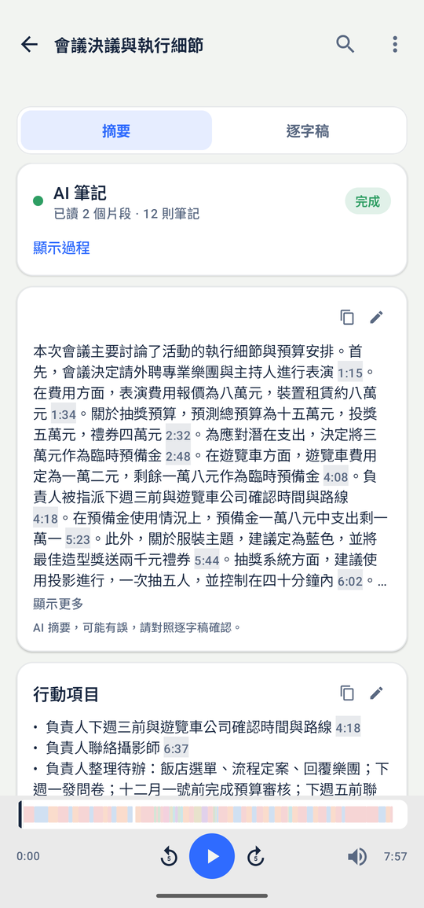 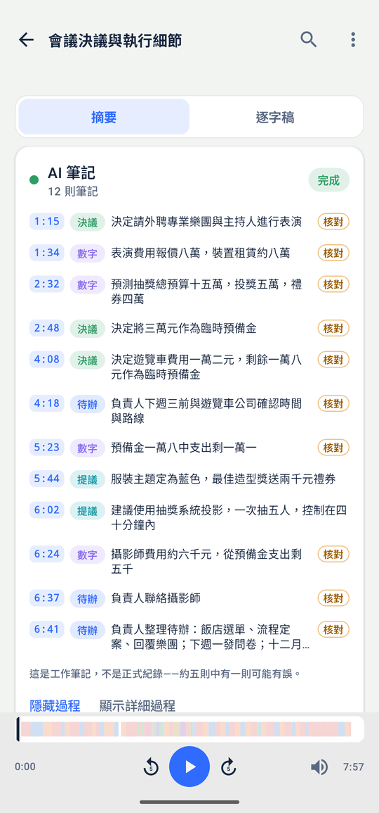 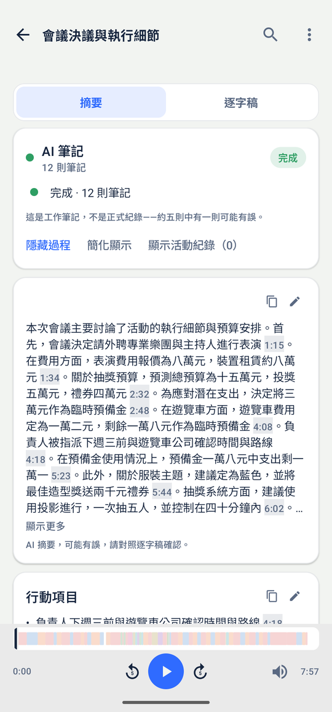

**AI 筆記** 卡片列出所有筆記：類型（決議、待辦、提議、未決、數字）與時間，時間一點就從原話播放；決議、待辦與數字另有 **核對**。下方是段落式摘要，灰色時間標籤同樣可播放，提到的語者以粗體和該語者的顏色標示（改名後跟著更新）；最下方一行是各語者的發言比例。

| 節點 | 如何到達 | 預期結果 | 驗證 |
|---|---|---|---|
| AI 筆記卡片狀態 | 摘要分頁 | 停止後依序：整理筆記中 → 撰寫摘要 → 完成 | ✅ 手動 |
| 重新開啟場次 | 首頁點已完成場次 | 筆記與時間點仍在（「N 則筆記」） | ✅ 手動 |
| 顯示過程／隱藏過程 | AI 筆記卡片 | 展開／收合筆記列表 | ✅ 手動 |
| 顯示詳細過程／簡化顯示 | 展開後 | 每段的處理與上下文用量 | ✅ 手動 |
| 顯示活動紀錄（N） | 詳細過程中 | 每則筆記的保留或捨棄原因 | ✅ 手動 |
| 筆記時間／核對 | 筆記上 | 從該時間播放 | ✅ 手動 |
| 編輯摘要（鉛筆） | 摘要卡右上 | 編輯摘要，儲存／取消 | ✅ 手動 |
| 複製摘要 | 摘要卡右上 | 提示「已複製摘要」 | ✅ 手動 |
| 摘要中的時間點 | 藍色時間 | 從該時間播放 | ✅ 手動 |
| 語者比例 | 點一下 | 展開／收合圖例 | ✅ 手動 |

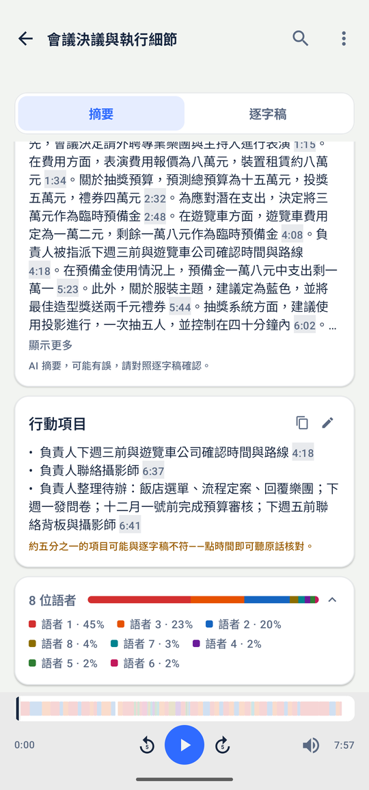 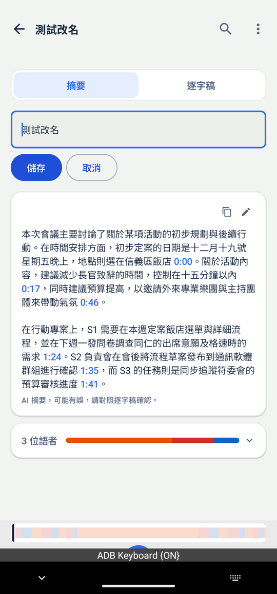

| 節點 | 如何到達 | 預期結果 | 驗證 |
|---|---|---|---|
| 標題 | 點頂端標題 | 編輯標題，儲存／取消 | ✅ 手動 |
| 行動項目卡片 | 設定 → 實驗功能開啟時 | 列在摘要下方，可複製與編輯 | ✅ 手動 |

## 7. 場次：逐字稿分頁

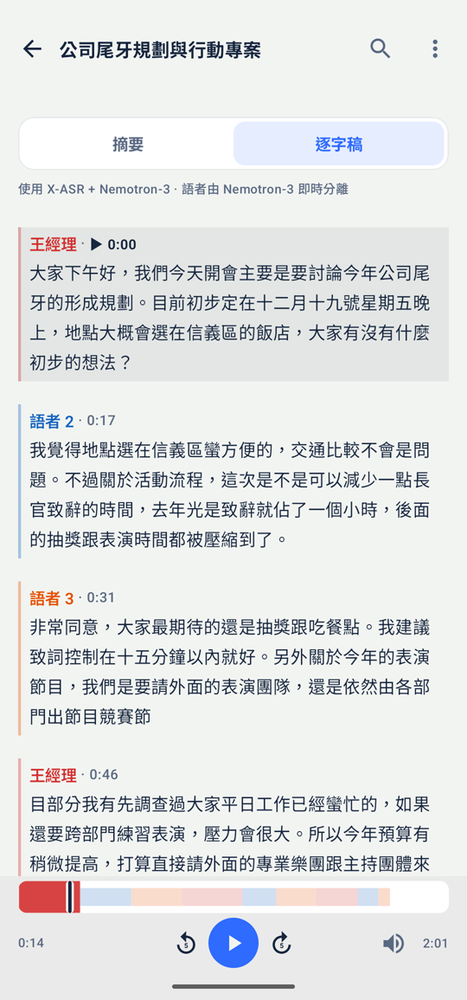 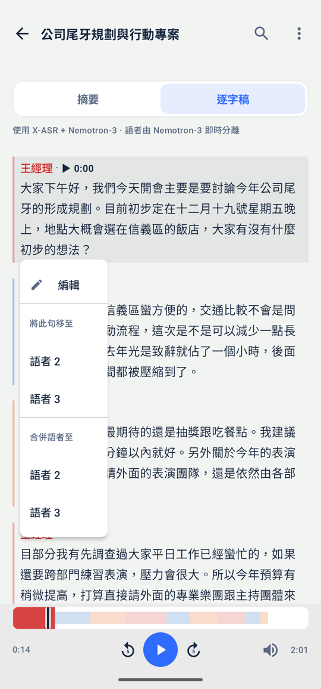 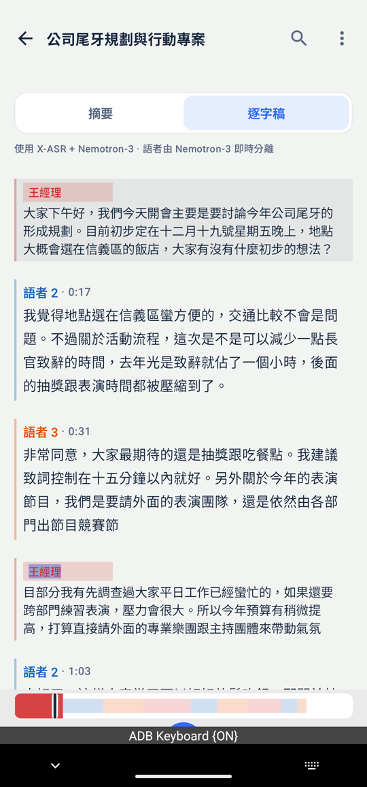

| 節點 | 如何到達 | 預期結果 | 驗證 |
|---|---|---|---|
| 點一句 | 逐字稿 | 從該句播放，播放中的句子高亮 | ✅ 手動 |
| 長按一句 → 編輯 | 長按選單 | 就地編輯，儲存後保存在場次中 | ✅ 手動（重新開啟後仍在） |
| 長按 → 將此句移至 → 語者 N | 長按選單 | 該句改派語者，保存在場次中 | ✅ 手動（重新開啟後仍在） |
| 長按 → 合併語者至 → 語者 N | 長按選單 | 整位語者併入另一位，其他語者的名稱不變 | ✅ 手動、✅ 自動（SpeakerEditsTest） |
| 點語者名稱 | 每段開頭的「語者 N」 | 直接改名（例如「王經理」）；清空則恢復預設 | ✅ 手動 |
| 搜尋逐字稿 | 頂端放大鏡 | 標示符合處，上一個／下一個，關閉搜尋 | ✅ 手動 |

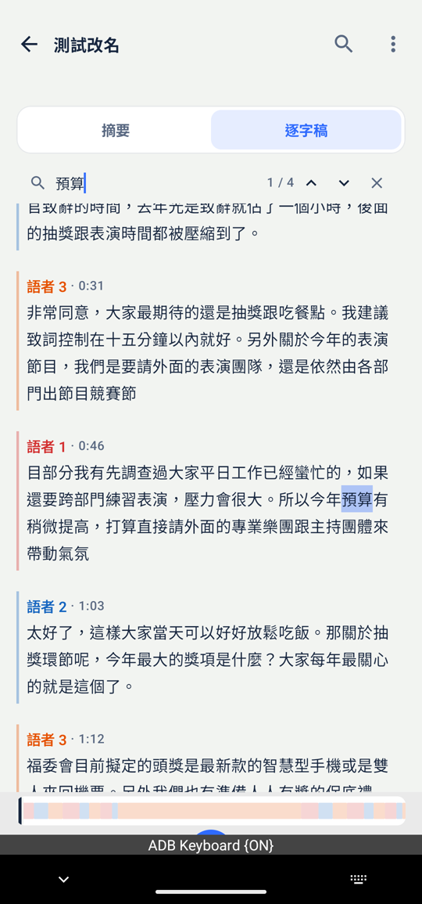

## 8. 播放列與場次選單

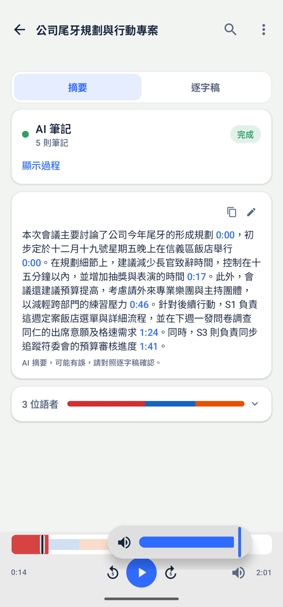 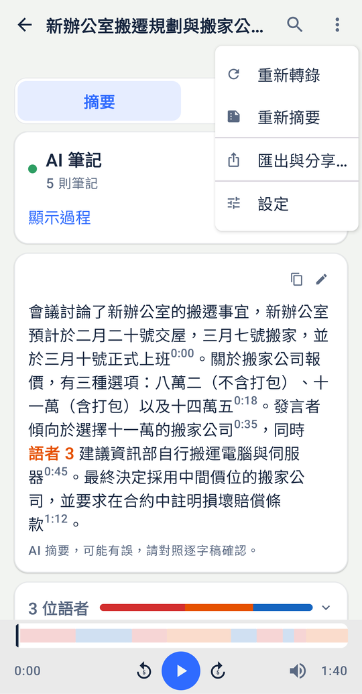 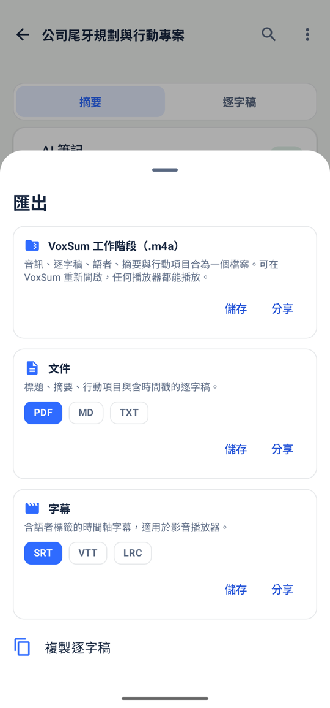

播放列的色塊代表語者，點或拖曳可跳轉。右上 **⋮**（更多選項）提供重新處理與匯出。

| 節點 | 如何到達 | 預期結果 | 驗證 |
|---|---|---|---|
| 播放／暫停 | 播放列 | 播放並切換圖示 | ✅ 手動、✅ 自動（TranscriptFlowTest） |
| 倒退 5 秒／快進 5 秒 | 播放列 | 跳轉 5 秒 | ✅ 手動 |
| 進度條 | 點或拖曳 | 跳到該處 | ✅ 手動 |
| 音量按鈕 | 播放列右側 | 音量滑桿、靜音 | ✅ 手動 |
| 重新轉錄 | ⋮ | 重跑語音辨識與語者分離，標題保留 | ✅ 手動 |
| 重新摘要 | ⋮ | 只重跑 AI 筆記與摘要；筆記不重複 | ✅ 手動 |
| 匯出與分享… | ⋮ | 匯出選單 | ✅ 手動、✅ 自動（ExportSheetTest） |
| 匯出：.m4a／PDF／MD／TXT／SRT／VTT／LRC → 儲存或分享 | 匯出選單 | 存檔或系統分享 | ✅ 手動（MD 儲存）、✅ 自動（ExportSheetTest、PdfExportTest） |
| 複製逐字稿 | 匯出選單底部 | 提示「已複製逐字稿」 | ✅ 手動 |
| 設定 | ⋮ | 設定（第 9 節） | ✅ 手動 |

## 9. 設定

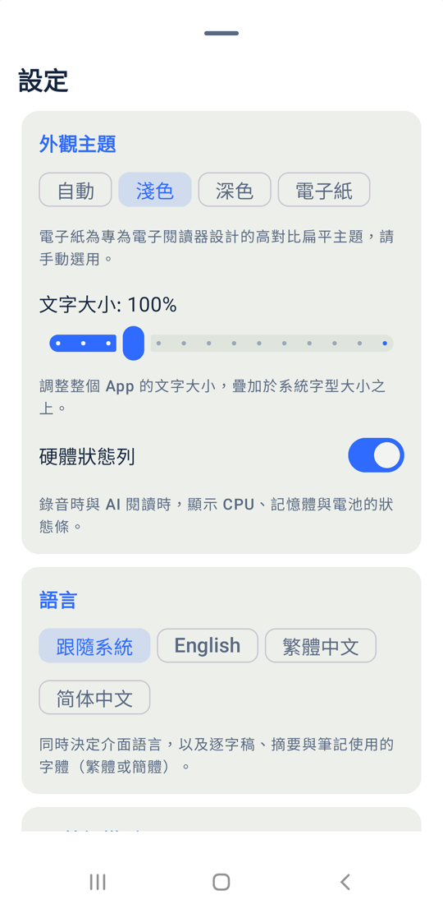 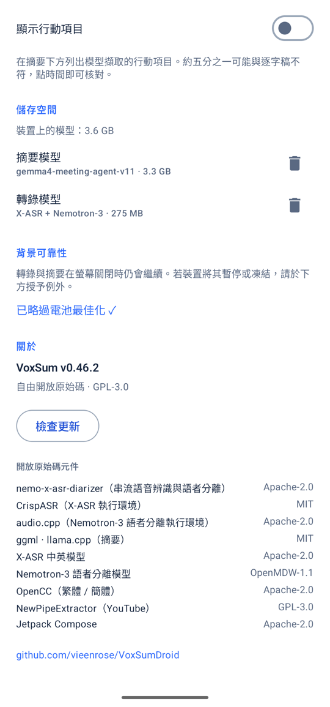

處理進行中時設定為唯讀。

| 節點 | 預期結果 | 驗證 |
|---|---|---|
| 外觀主題：自動／淺色／深色／電子紙 | 立即套用 | ✅ 自動（SettingsContentTest） |
| 文字大小（85–150%） | 整個 App 的文字（含對話框）立即放大或縮小，疊加於系統字型大小；重新開啟 App 後保留 | ✅ 手動 |
| 硬體狀態列 | 錄音與 AI 閱讀時，計時器下方顯示 CPU／GPU／記憶體／電池細條；數值過高時轉紅（GPU 僅在裝置允許讀取時顯示）；預設開啟 | ✅ 手動 |
| 語言：跟隨系統／English／繁體中文／简体中文 | 介面與產生的文字一起切換 | ✅ 手動、✅ 自動（SettingsContentTest） |
| 即時語者標註延遲（5–30 秒） | 錄音時語者標籤出現的延遲；重新開啟 App 後保留 | ✅ 手動 |
| AI 筆記模型：行動版 E2B／行動版 E4B | 下次閱讀時使用所選模型（未下載時先下載）；E4B 只在 RAM 8 GB 以上的手機可選 | ✅ 手動（Note 10+：E2B、E4B） |
| 實驗功能：顯示行動項目 | 摘要下方出現行動項目卡片 | ✅ 手動 |
| 儲存空間：模型與刪除 | 顯示用量；刪除前確認「刪除這個模型？」，刪除後下次使用時重新下載 | ✅ 手動 |
| 背景可靠性：允許背景執行 | 系統的電池最佳化例外對話框 | ✅ 手動（Note 10+，首次錄音時出現） |
| 關於：檢查更新、GitHub | 顯示「已是最新版本」或更新橫幅 | ✅ 手動（檢查更新）、✅ 自動（SettingsContentTest，版本號） |

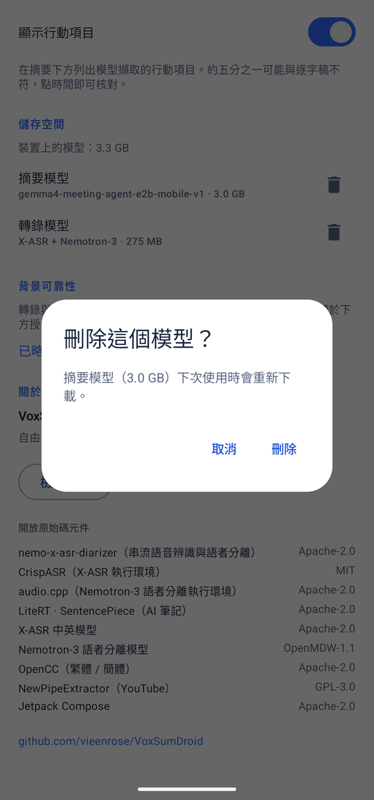

## 10. 中斷錄音的復原

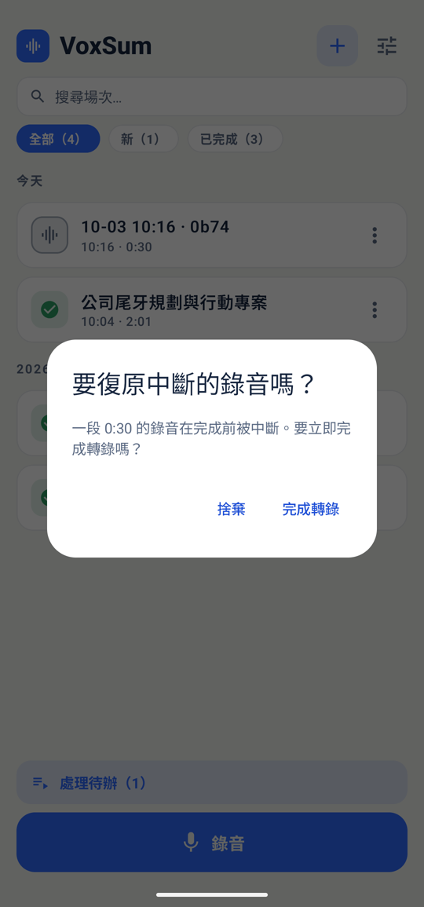

錄音中 App 被系統終止時，下次開啟會詢問 **要復原中斷的錄音嗎？**

| 節點 | 預期結果 | 驗證 |
|---|---|---|
| 完成轉錄 | 處理已錄下的部分並存入場次庫 | ✅ 手動 |
| 捨棄 | 刪除這段錄音 | ✅ 手動 |

---

### 尚未驗證（⬜）的節點

更新橫幅（需要有更新的版本才會出現）。

### 如何重跑自動測試

```bash
scripts/test-on-device.sh <實機序號> -- -e class studio.voxsum.AddSourceSheetTest,studio.voxsum.SourceSheetsTest,studio.voxsum.UiComponentsTest,studio.voxsum.SettingsContentTest,studio.voxsum.ExportSheetTest,studio.voxsum.TranscriptUiTest,studio.voxsum.TranscriptFlowTest
```

Compose 介面測試需在實機上執行（x86_64 模擬器上會出現 “Unable to resolve activity”，見腳本開頭說明）。
